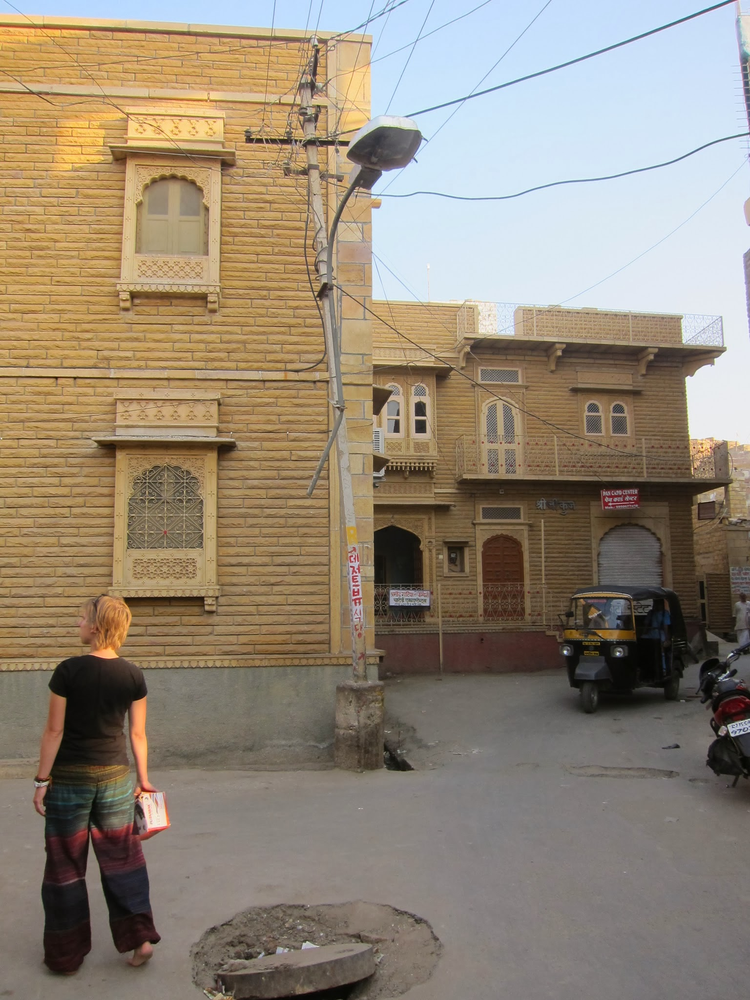
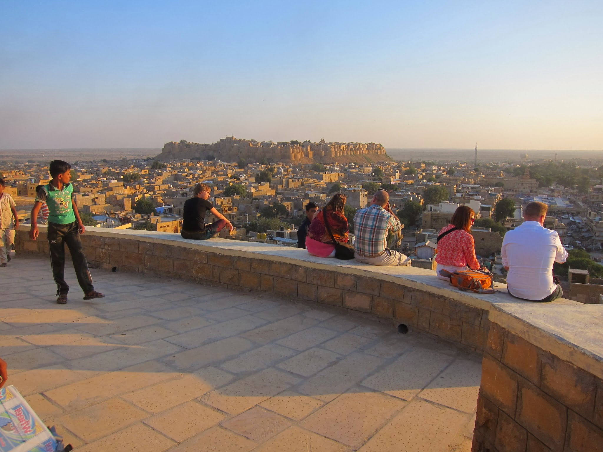
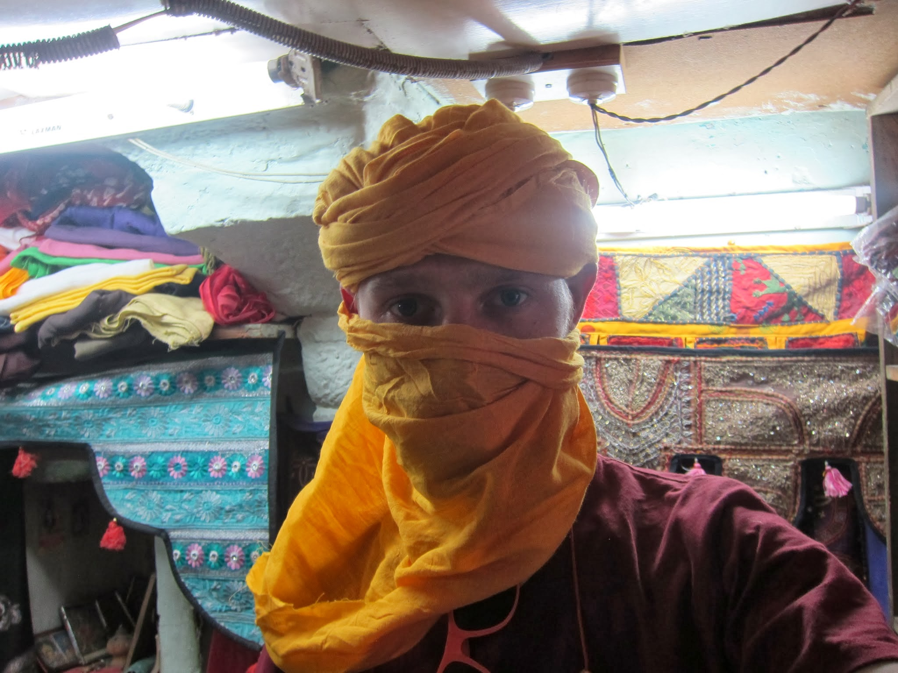
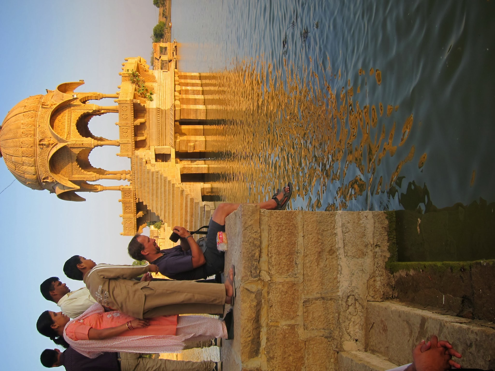

W Jaipurze, naszym punkcie przesiadkowym, wsiadamy w mocno przeładowany, głównie żołnierzami, pociąg. Wysocy, dobrze zbudowani, niesamowicie pogodni, sympatyczni i pomocni. Znajdują mi jakimś cudem siedzące miejsce, ale konduktor wyprasza nas ze sleeper class, mówiąc, że mamy iść do ogólnego przedziału, bo tu nie ma dla nas miejsca. Pociąg rusza zanim tam docieramy, więc wpychamy się w kolejny sleeper class. Lokujemy się na plecakach w przejściu koło kibli, gdzie dopada nas kolejny konduktor. Tym razem jednak urzędnik z rozbrającym, pełnym politowania uśmiechem mówi:

– Chodźcie, usiądziecie w następnym wagonie na mojej pryczy.

Super! Przeciskamy się znów przez zatłoczony pociąg. Michał wybiera opcję spania na podłodze, rozkłada karimatę w końcu wagonu i próbuje kimać. Ja idę na pryczę konduktora, który zgania z niej wojskowych i mówi, żebym ułożyła się spokojnie do spania. Przykrywa mnie swoim kocem, a sam upycha się w półsiedzącej pozycji koło mnie. Wysiada w Jodhpurze, zostawiając nam swój numer telefonu i zaprasza do odwiedzenia go, jeśli tylko będziemy w okolicy.

Pare godzin później wysiadamy w Jaisalmerze i ruszamy w stronę miasta. Początkowo idę w japonkach Michała, a później boso, bo tak wygodniej – w pociągowym zamieszaniu straciłam jednego buta, więc drugi wylądował w dworcowym koszu (misja na dziś: kupić mi japonki).

Miasto wygląda fantastycznie z górującym nad nim fortem i jest pierwszym w Indiach, które robi na mnie tak dobre wrażenie. Znajdujemy przyzwoity pokoik, co prawda bez okna i łazienki, ale za to przestronny, z półkami i obrazami na ścianach. Robimy wstępne rozeznanie na temat camel safari organizowane przez nasz hotelik. Brzmi super, ale jutro chcemy wypytać w dwóch-trzech agencjach.

Michał uzbraja się już w turban. Ciągnie nas na pustynię…

Po małym researchu decydujemy się na safari w Thar Desert. Czekają nas 4 noce (5 dni) na pustyni ze spaniem na wydmach pod gołym niebem. Towarzyszyć nam będą 2 młode brytyjki i wielbłądzi przewodnik (camel man). Nie możemy się doczekać! Jutro jeszcze spokojny dzień w złotym mieście i pojutrze w drogę. Jaisalmer urzekł nas bez reszty. Tu nawet naganiacze i sklepikarze są jacyś tacy nienahalni i zupełnie przyjemni, co pewnie wykorzystamy polując na kolejne koszulki i jakąś czapkę, żebym mogła uchronić moją łepetynę od udaru.

