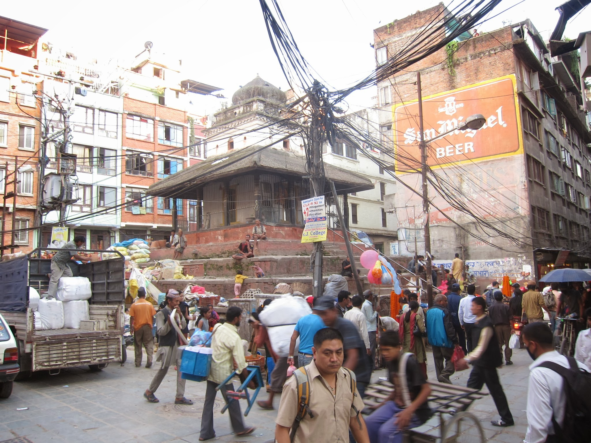
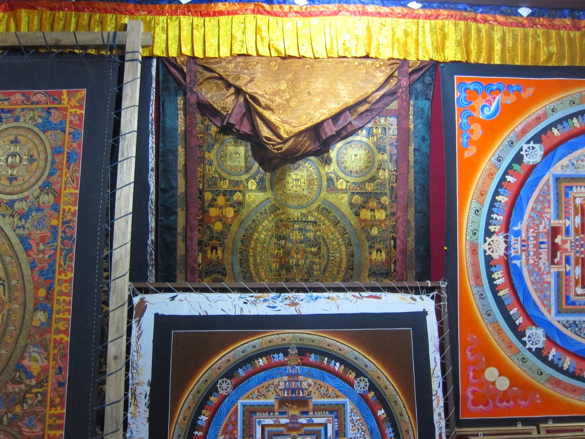
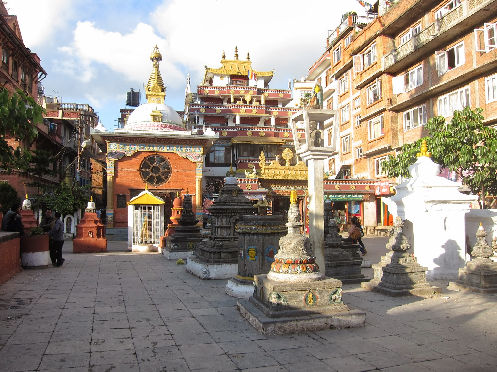
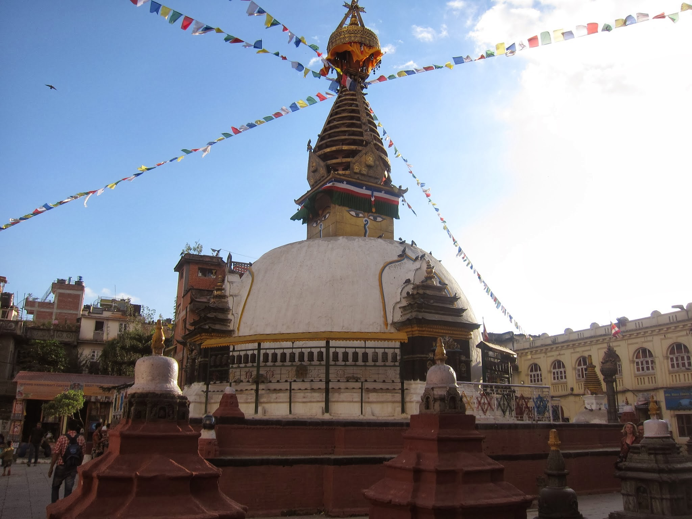

Kathmandu zachwyca, przeraża i wciąga. Wychodząc z domu solennie obiecujemy sobie, że wrócimy za 30 min. Mija 1,5 h, a my nadal spacerujemy wąskimi uliczkami Thamelu i okolic. Przeraża natłok dźwięków, głównie klaksonów, ilością wszędobylskich motorów i skuterów, totalnym chaosem, ilością pyłu w powietrzu i poziomem higieny, zwłaszcza jeśli chodzi o mięso. Zwierzęta zarzynane i oprawiane są właściwie na ulicy, na oczach przechodniów. Wstępnie pocwiartowane kawałki leżą potem nieraz godzinami na stoliku czekając na swoich nabywców. Mijając jeden z takich przybytków pokazuję palcem i mówię do Michała:

– Popatrz, świnia. To chyba nie będziemy jeść mięsa w Nepalu?

– Oj zdecydowanie nie będziemy!

Mamy też już swoją ulubioną tanią knajpkę, z przepysznym jedzonkiem 🙂

Kathmandu zachwyca. Dobiegająca zewsząd melodia buddyjskiej mantry. Kolorami sprzedawanych tkanin i różnorodnością biżuterii, ozdób, pamiątek, ale też rzeczy codziennego użytku. Zapach kadzidełek przywitał nas już na lotnisku i odtąd nie opuszcza nas niemal na krok. No chyba, że aktualnie mijamy restaurację lub straganik z przyprawami (obowiązkowo mielone na miejscu, już po dokonaniu zakupu), bo wtedy dominuje curry, chili, cynamon.

Za przewodnika po gąszczu uliczek głównie robi Michał, choć ja powoli też zaczynam się całkiem nieźle orientować. Dziś jednak trochę pobłądziliśmy po nieznanych nam dotąd zakątkach, małych dziedzińcach i wyrastających na nich znienacka buddyjskich świątyniach. W efekcie jednak zupełnie się pogubiliśmy. Michał dziarsko wyjął z plecaka plan miasta, kompas i zasięgając języka szybko ustalił nasze położenie.

– Tu jesteśmy – wskazał mi miejsce na mapie.

– O! Zobacz, tu jest coś fajnego! Zaprowadź nas tam!

Tak oto, zamiast iść coś zjeść (bo właśnie byliśmy na etapie szukania miejsca na drugie śniadanie), trafiliśmy do Swayambhu, buddyjskiej stupy, zwanej także 'Monkey Temple’. Już po chwili przekonaliśmy się, skąd ta nazwa: małpki! Były wszędzie 🙂

Wspinaczka po stromych stopniach prowadzących do położonej na szczycie wzgórza świątyni została sowicie wynagrodzona rozpościerającymi się widokami na Kathmandu. Wrażenie zrobił na nas cały kompleks, złożony ze świątyni, klasztoru, szkoły i kilkunastu innych budowli, których dokładnego przeznaczenia nie odkryliśmy (sprawiały wrażenie budynków mieszkalnych dla mnichów i ich uczniów).

