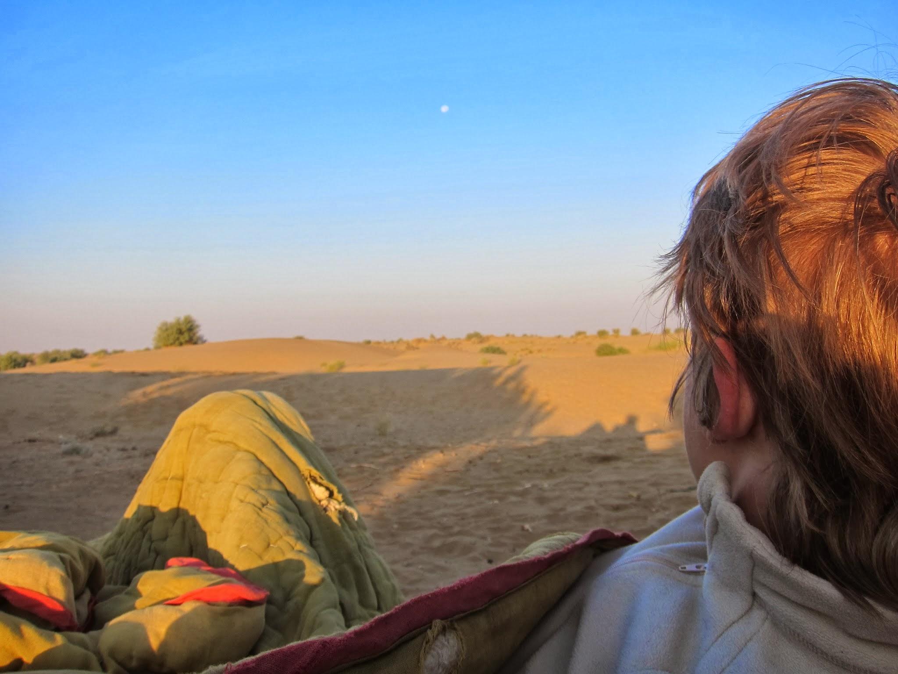
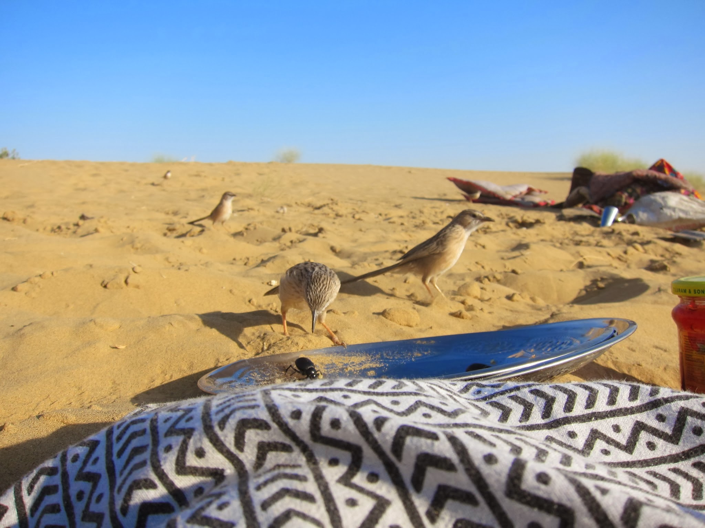
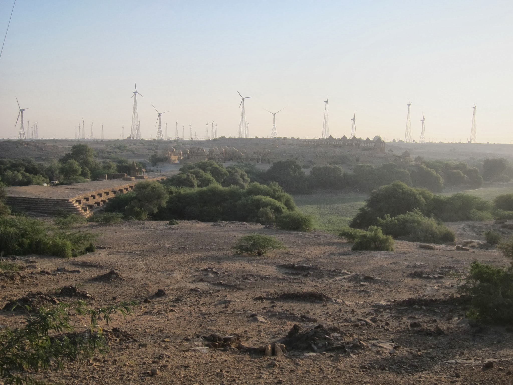
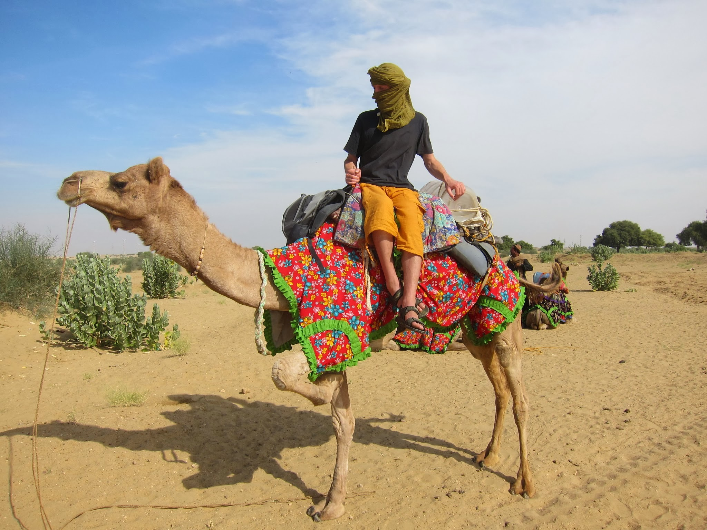

Wschód słońca perfekcyjny! Wystarczyło otworzyć oczy i podziwiać – nasze pustynne lóze zostało rozstawione w idealnym miejscu:)

Wbrew pozorom na pustyni jest mnóstwo życia. Ogromne, czarne chrząszcze, gryzonie, ptaki, camele, gazele, psy, kozy, krowy, mrówki, muchy, skaczące pająki no i oczywiście pustynna ludność.

Mieszkańcy okolicznych wiosek, rozsypanych po rzadko zalesionym terenie co kilkanaście kilometrów, posługują się tutaj pustynnym językiem. Hindi znają, ale w różnym stopniu, podobnie jak angielski. W Jaisalmerze jest im za głośno i twierdzą, że mieszkańcy tego miasta dobrze wiedzą, kiedy ktoś z pustyni ich odwiedza i ich oszukują. Zupełnie jak nas!

Ludzie tutaj rozmawiają ze sobą dużo, ale nie bardzo wiemy o czym. Pojawiają się znikąd i odchodzą donikąd.

Wokół pełno wiatraków prądotwórczych, całe farmy elektrowni wiatrowych ciągnące się od Jaisalmeru dziesiątkami kilometrów. Zostały wybudowane przez żołnierzy, którzy urzędują tutaj z racji niedaleko wytyczonej granicy z Pakistanem.

Ostre krzewy wbijają się boleśnie w skórę nóg i dłoni. Ukrywają się w piaszczystej drodze, sierści zwierząt, kocach, siodłach, plecakach i gdzie tylko uda im się dostać.

Dzisiaj zataczamy kółko i rozbijamy obóz przy magazynie (chatce skleconej z badyli i traw) na koce i łóżka dla turystów oraz camel food.

Przy lunchu wydoiliśmy z naszym młodocianym camelmenem kozę, coby nie pić znowu czaju z mleka z proszku.

W zwiedzanych przez nas wioskach dzieci oblatują nas jak muchy żebrząc o rupie, długopisy szkolne, cukierki a nawet próbując obedrzeć Kasię ze spodni.

21 listopad

Zatoczyliśmy dzisiaj kolejne kółko. Po napojeniu cameli (ostatni raz przedwczoraj tuż po starcie) w water station (kilka studni głębokich na 15-25 m) jemy lunch pod rozłożystym drzewem. Większość tutejszych drzew jest rozłożysta i niemal idealnie równo przycięta od dołu. Obserwacja tego zjawiska przyszła wraz z olśnieniem, gdy zobaczyłem wielbłądy wyciągające grube szyje w poszukiwaniu zielonych listków.

Spędzamy na wielbłądach ok 2-4h dziennie. Niby miało być 5h, jak to różne firmy opowiadały, ale jazda jest nadal bolesna, więc w sumie lepiej, że nie jeździmy tak długo.

Dziś kłusowaliśmy kilka razy, gdy mieliśmy trochę równego terenu. Wrażenia podobne jak podczas jazdy konnej, ale nijak nie mogę złapać rytmu. Trochę nam wywraca trzewia.

Muchy denerwują, mrówki gryzą. Dostępne pozycje: leżąca, półsiedząca bez oparcia, siedząco-boląca na camelu, stojąca – bez celu.

Wielbłądy to skomplikowane zwierzęta. W każdym odnóżu mają o 1 staw więcej niż my. Przy siadaniu składają się jak transformersi, a poza tym dziwnie jedzą. Gdy tylko dorwą swoją specjalną szamkę albo krzewy lub drzewa, to wcinają ile wlezie. Później, gdy mają trochę wolnego, to jedzenie cofa im się przez cały przełyk z żołądka do jamy ustnej i żują. Potrafią tak żuć całą noc, chrupiąc jednostajnie ze wzrokiem wpatrzonym w pustkę. Chyba nie śpią, a przynajmniej ja nie zauważyłem żadnego wielbłąda pogrążonego w drzemce. Czasem tylko kładą pyski na ziemi, jak już są zmęczone żuciem. No i tarzają się w piasku wymachując niepodkutymi „kopytami”.

23 listopad – powrót

Trochę już cieszy nas wizja powrotu do miasta, a Kasię szczególnie raduje świadomość, że będzie się można wreszcie wykąpać, bo swędzi ją już dosłownie każdy centymetr skóry 🙂

Lunch jemy razem z dwójką Brytyjczyków, ojcem i synem, z którymi dzielimy się uwagami na temat poziomu higieny w Indiach i innymi ciekawostkami z podróży. Polecają nam miły hotel w Jaisalmerze za 1500 rs, mówiąc, że to tanio a pozwoli nam porządnie wypocząć po trudach safari. Z zaciekawieniem obserwujemy ich reakcję na wieść, że dzienny budżet na nas dwoje to 1300 rs i że zupełnie nieźle nam idzie mieszczenie się w tej kwocie 😉

Salim, starszy z camelmanów, dostaje napiwek. Lakia otrzymuje od nas w prezencie czołówkę, którą bezustannie od nas pożyczał na trasie. Na jego twarzy widać było jednak rozczarowanie – ewidentnie spodziewał się gotówki. Jirka, wytrawny czeski podróżnik, którego poznajemy następnego dnia w Jaisalmerze, konkluduje:

– Nie przejmujcie się, dalibyście mu 10.000 rs, też by się nie ucieszył, bo przecież zawsze mógł dostać 20.000.

Niestety, dużo w tym prawdy…

Wieczorem:

Natłok dźwięków za oknem naszego pokoju i wewnątrz (wentylator i bzycząca lampka) sprawia, że zaczynam tęsknić za pustynią…