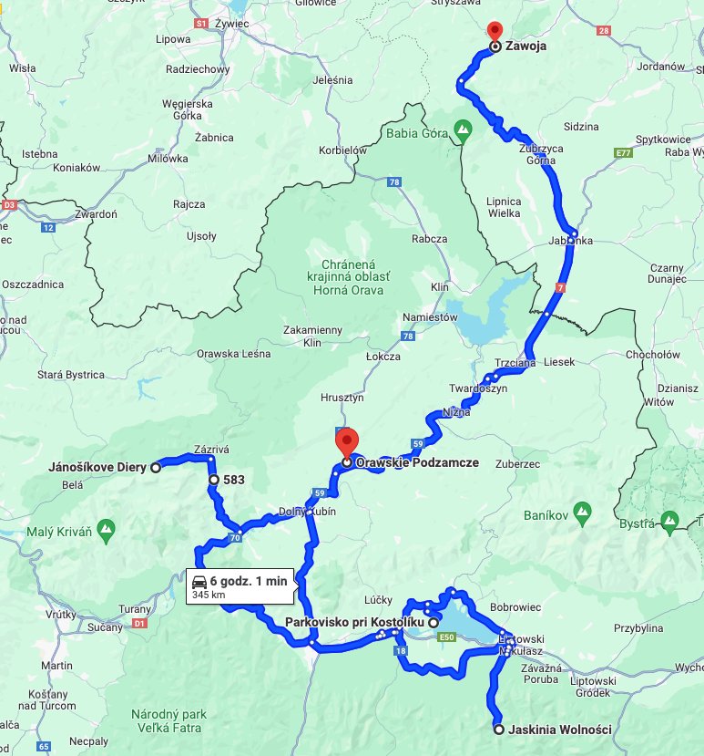

## Wydatki

- wstęp do Jaskini Wolności 35 EUR
- parking pod jaskinią 10 EUR
- prowizja w Euronecie 3.95 EUR
- paliwo

Razem ok. 50 EUR.
## Czas
2 noclegi w tygodniu

## Trasa
- Zawoja
- park narodowy Mała Fatra (na park4night super miejscówka, odsłonięta od drogi)
- Janosikove Diery
- plaża przy jeziorze Liptovska Mara
- spanie gdzieś na dziko z północnej strony jeziora
- Jaskinia Wolności
- Oravski Podzamok
- Zawoja

Razem ok. 350 km

## Sprzęt
- 2 namioty 2-3 osobowe
- śpiwory
- materace pompowane i pompka
- koce
- podstawowe kuchenne
- palnik gazowy i butla mała turystyczna

## Przygody

### Oravski Podzamok

Chcieliśmy się zatrzymać pod zamkiem i go obejrzeć z bliższa. Z drogi wygląda widowiskowo. Nie chcieliśmy jednak płacić niepotrzebnie za parking. Stanęliśmy za parkingiem płatnym przy rzece. 

Nie było parkingowego, a strona do samodzielnego opłacenia nie chciała się załadować. Gdy się wreszcie załadowała, to okazało się, że biorą 7 EUR za cały dzień. Uznaliśmy, że to przesada i stwierdziliśmy, że idziemy na krótką chwilę i zaraz wrócimy.

Spod zamku niewiele było widać. Lepszy widok był z mostu. Kupiliśmy lody i poszliśmy z powrotem.

Wyjeżdżaliśmy już, gdy jakiś facet zatarasował drogę, przerzucił żerdź nad drogą i powiedział, że nie puści i będzie wzywał policję, bo to prywatny teren 😲

Po krótkiej kłótni powiedział, że jak mu pokażemy bilet, to nas puści. Wróciłem do auta, żeby ten bilet kupić. Dzieci już się przestraszyły i rozryczały, że nie pojedziemy do domu 😄

Jednak zanim doczekałem się, aż mi się załaduje cinkciarz, w którym wymieniam walutę, to pieniacz podszedł do nas, więc dałem mu resztę monet, jakie mieliśmy (jakieś 2.5EUR) i powiedziałem, że więcej nie mam. Uradował się, zabrał kasę i poszedł.

Wniosek: zawsze trzeba mieć jakieś monety zawsze przy sobie. I najlepiej banknoty schować gdzie indziej 😉

## Co polecamy?

Na pewno Janosikove Diery. Najmłodszego (prawie 5 lat) musieliśmy mocno asekurować w kilku miejscach, drugorodną tylko trochę, a najstarszy sam śmigał. Wąwóz robi wrażenie i nasz 

Jest kilka fajnych miejscówek do spania na dziko, choć dużo pochyłych miejsc. Na namioty udało nam się jednak znaleźć wystarczająco płaskie.

## Co odradzamy?

Oglądanie z zewnątrz zamku w Oravskim Podzamoku. O ile z ekspresówki wygląda super, o tyle spod samego zamku nie widać prawie nic.
