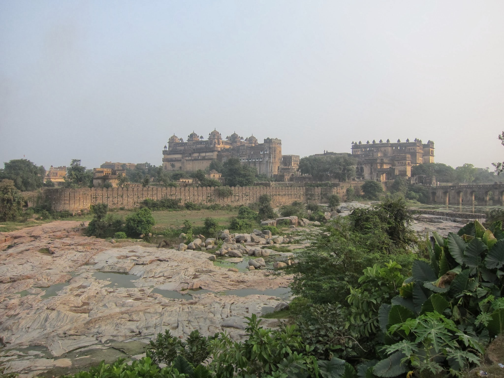
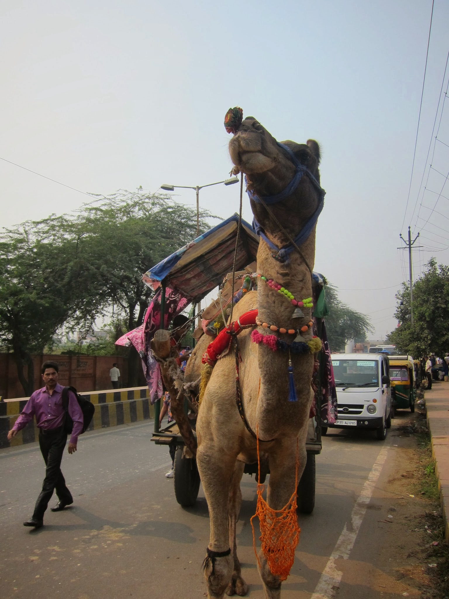
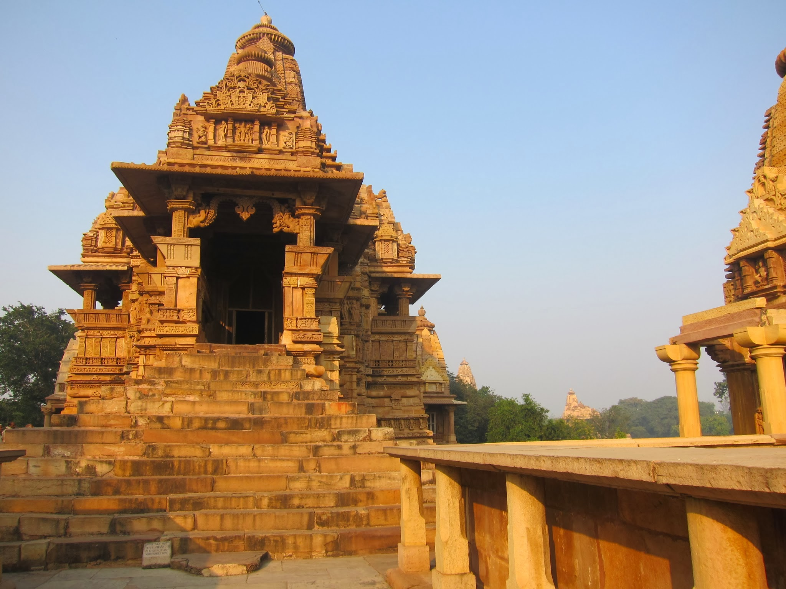
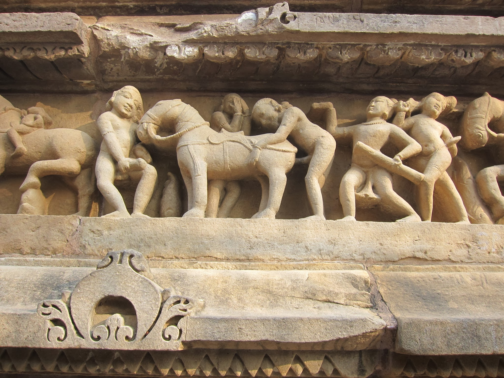

Nie mogąc przez kilka dni z rzędu znaleźć noclegu przez CouchSurfing w Delhi w ostatniej chwili zmieniamy plany: zamiast na północ do ogromnej stolicy jedziemy na wschód, do malutkiej, 10-tysięcznej Orchhy. Mieścinka jest przystankiem przed dużo bardziej znanym Khajuraho, które i dla nas jest głównym celem tej eskapady.

W Orchha spędzamy jeden dzień zwiedzając zaniedbany fort Mughalów z piaskowca (głównego budulca tej epoki i regionu) i dochodzimy do wniosku, że mamy już dość popularnych, turystycznych zabytków. Tym bardziej, że wstępy do nich nadwyrężają nas budżet. Postanawiamy sobie, że zamiast zwiedzać n-ty pałac lub fort, wolimy karnąć się wielbłądem po pustyni 🙂

Khajuraho jest jeszcze małym odstępstem od tego postanowienia, ale w tym wypadku nie żałujemy wydanych rupii, bo świątynie z X i XI wieku są fantastycznie zdobione rzeźbami półnagich kobiet, scen erotycznych oraz pochodów żołnierzy i słoni, scen bitewnych i bóstw, którym są poświęcone: głównie Vishnu, niektóre Shivie.

Najczęściej fotografowane rzeźby przedstawiają 9-osobową orgię, seksualną pozycję ze staniem na głowie oraz mężczyznę bardzo blisko zaprzyjaźniającego się ze swoją klaczą.

Mieszkańcy zaskakują nas całkiem niezłą znajomością języka polskiego. Próbują nam też za wszelką cenę pomóc i dotrzymać towarzystwa, jednak podchodzimy do wszystkich ofert bardzo sceptycznie. Być może niesłusznie, ale jesteśmy jesteśmy dość mocno zrażeni dotychczasowymi doświadczeniami z naciągaczami. Mamy jednak nadzieję, że Khajuraho będzie pierwszym miastem, które zacznie odmieniać nasze podejście. I wreszcie przestaniemy mieć wrażenie, że dla lokalnych jesteśmy tylko chodzącym workiem złota.