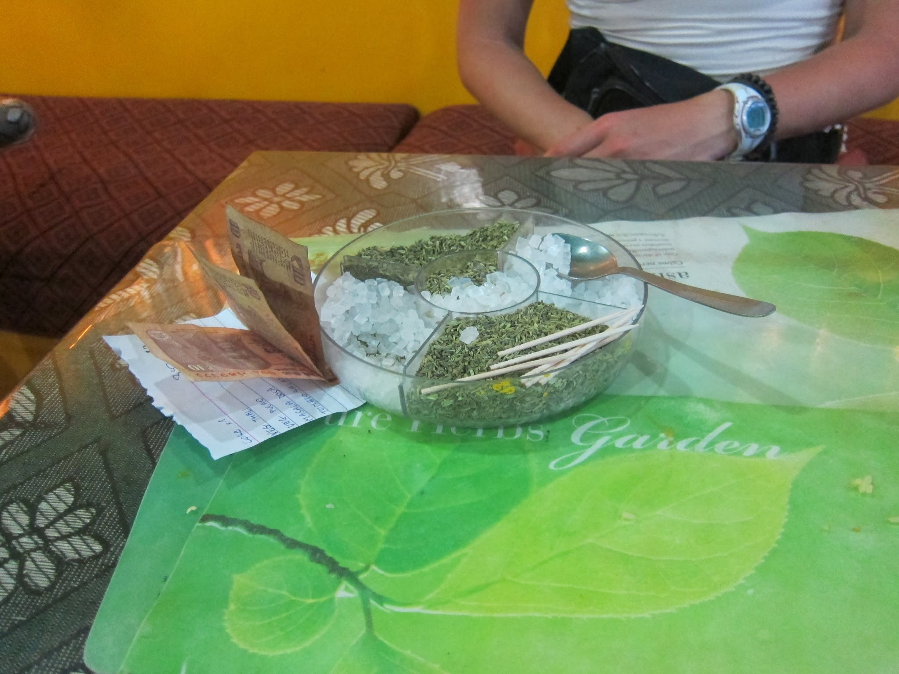
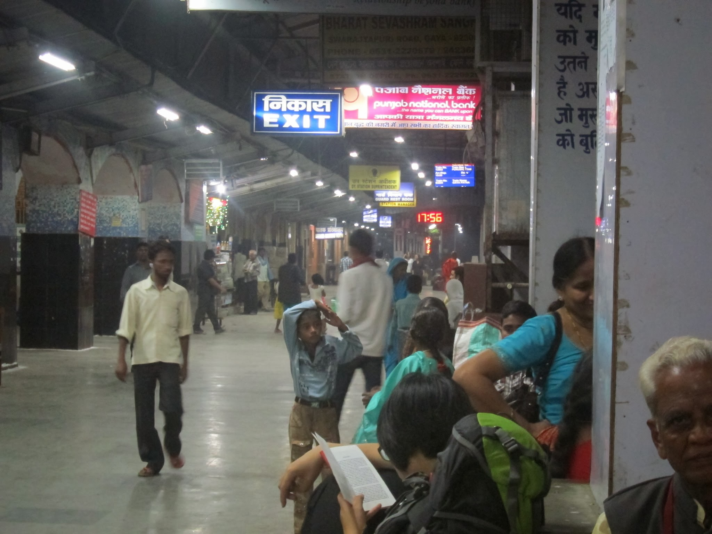
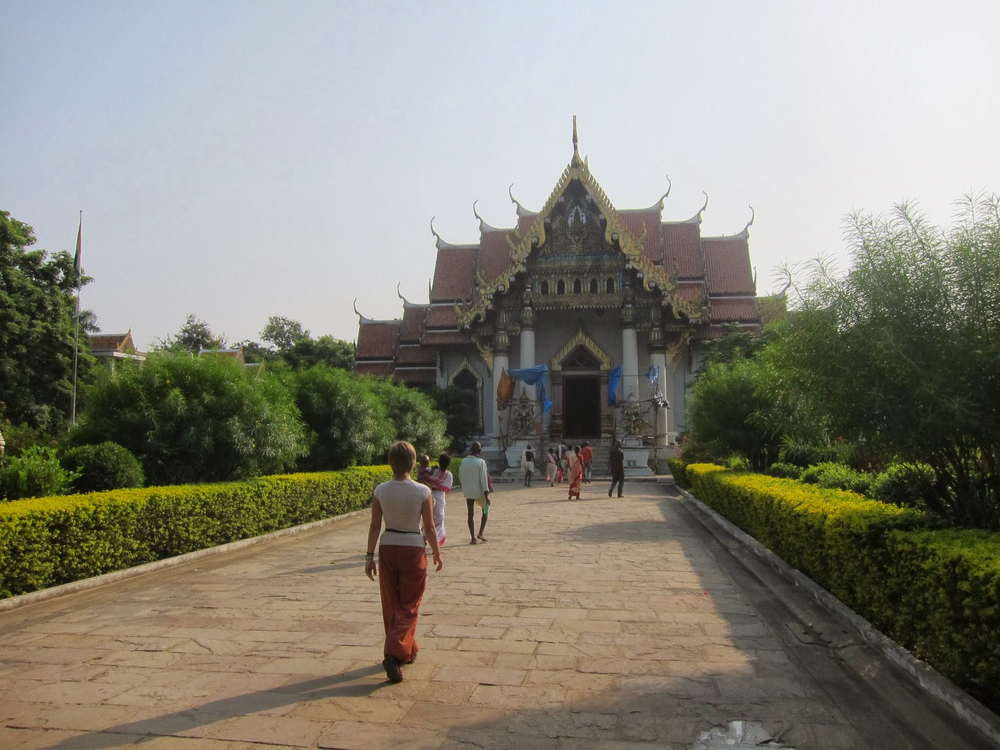
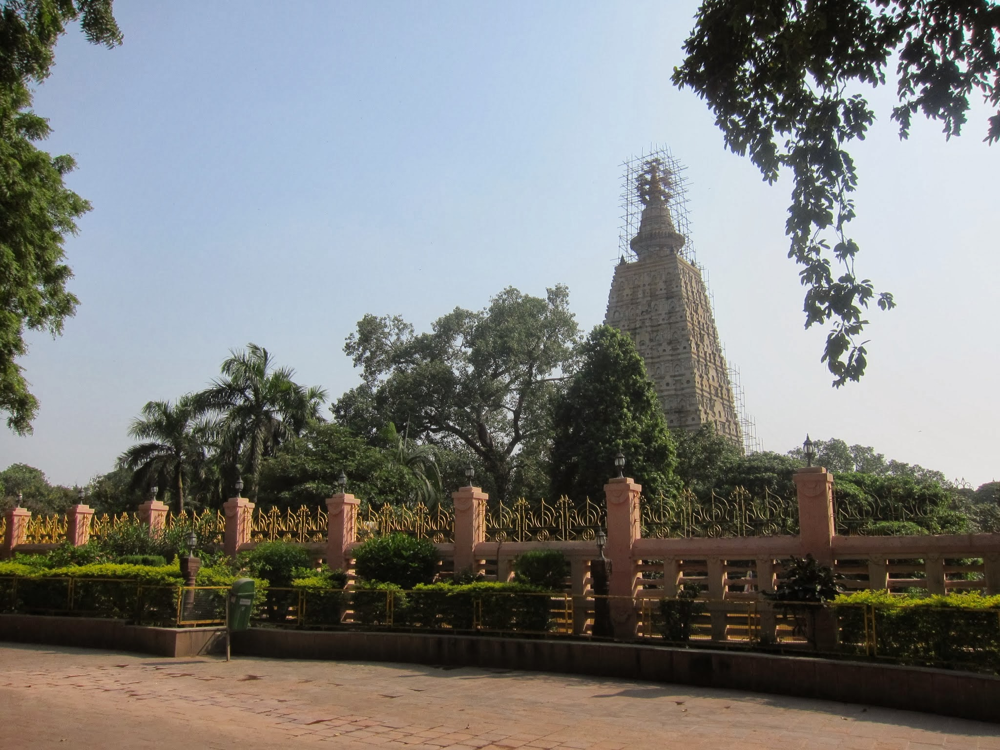

Lassi, słodzony i zimny jogurt, to najlepszy deser, jaki hindusi mogli wymyślić dla swojej pikantnej kuchni. Napój super łagodzi ogień płonący w ustach po niemal każdym posiłku. Hinduska kuchnia podbija nasze serca, kojąc zmęczenie absurdalną ilością i natężeniem klaksonów (najgorsze są te na wyposażeniu autorikshaw i w wielu motorach).

Z każdej knajpki wychodzimy przejedzeni i obiecujemy sobie, że już nigdy tyle nie zamówimy – póki co, rozsądek swoje, ale silna wola zwycięża 🙂

Michał napalił się na naukę hindi (zaczynając od alfabetu dewanagari) – to przydatna sztuka, która znacznie ułatwia poruszanie się po dworcach kolejowych i ich rozkładach.

Ja póki co mniej więcej opanowałam cyferki, aby móc choć trochę zorientować się w cenach. Te narazie wypisane są głównie arabskimi znakami (w Nepalu było inaczej – tam wszystkie ceny wypisane były śmiesznymi wężykami).

Rozpoczynające się dzisiaj święto Diwali przygniotło nas natłokiem dźwięków muzyki i wybuchających tu i ówdzie petard. Ciekawa jestem bardzo jak będzie wieczorem – w końcu to festiwal światła, a przygotowania do niego widać było już od kilku dni. Wszystkie biura, domy, knajpki i urzędy obwieszane były kolorowymi lampkami i żółto-pomarańczowymi kwiatami.

Inwestycja w przewodnik Lonely Planet India była strzałem w dziesiątkę. Przydatne porady, m.in. na temat rezerwacji biletów kolejowych, orientacyjne ceny noclegów, posiłków i transportu, a przede wszystkim konkretne sugestie odnośnie najlepszych miejsc noclegowych i restauracji sprawiają, że nie poruszamy się po omacku, jak ślepy we mgle. Pomocne są też oczywiście wskazówki co zobaczyć i gdzie pójść, by efektywnie wykorzystać czas w danym miejscu.

Nasze początki, pomimo nepalskiego przygotowania, były trudne. Przygraniczne Raxaul to najbrzydsze i najbrudniejsze miejsce, jakie do tej pory widzieliśmy. Ogarnęło nas lekkie przerażenie, że mamy w tym miejscu spędzić kolejne 3 miesiące. Pociągiem udało nam się wydostać do Muzaffarpur, punktu przesiadkowego w kierunku Patny – stolicy stanu Bihar. Kolejny pociąg zabiera nas do Hadipur, skąd autorykszą mkniemy przez rozwieszony nad Gangesem kilkunastokilometrowy most. Jest środek nocy, więc nie widzimy wiele, ale już sama długość mostu robi wrażenie i pozwala wyobrazić sobie ogrom rzeki pod nami. Z Patny podjeżdżamy jeszcze kawałek do Gaya, skąd już bliziutko nam do Bodgaya – miejsca, gdzie wieki temu, siedząc pod bodhi tree, książę Siddharta Gautama osiągnął Oświecenie, stając się Buddą.

Gdziekolwiek się nie pojawimy, wzbudzamy powszechne zainteresowanie. Dopada nas zewsząd „hello, my friend” i „where are you from”, główne wstępy do dalszej konwersacji. Riksiarze korzystają jeszcze z „where are you going” i tych zbywamy milczeniem. To narazie najskuteczniejsza metoda, żeby się od nich opędzić. W pociągach ludzie starają się nam pomóc jak potrafią, szukając wolnego miejsca do siedzenia w zatłoczonych przedziałach, martwią się o nasze bezpieczeństwo (Bihar to najbiedniejszy ze stanów i zdarzają się tutaj rabunki pociągów i autobusów) i o to, jak poradzimy sobie na kolejnej stacji.

Spotkaliśmy m.in. bardzo wykształconego nauczyciela nauk socjalnych, który od dziecka interesował się Polską, a byliśmy pierwszymi Polakami, których spotkał w swoim życiu, pomimo kilkuletniej pracy w hotelu w Agrze. Spędzamy więc długie pociągowe godziny (7h z okładem na odcinku 130 km), rozmawiając o tym jak żyje się w Indiach a jak w Polsce, o najnowszej historii świata, II wojnie światowej, polityce USA i Chin, Izraelu i napiętych relacjach Indii z Pakistanem. To, co bardzo pozytywnie zaskakuje, to fakt, że większość z Hindusów (w tym nastolatkowie) wie, gdzie leży Polska, a część rezolutnie upewnia się, że Warszawa, to nasza stolica.

Wybucham śmiechem, bo właśnie przez podłogę knajpki, w której siedzimy, spod jednej lodówki pod drugą przemknęła mysz, potykając się komicznie o klapek na swojej drodze.  
– Ale zapiernicza – komentuje Michał.

Nie da się ukryć, że jakiekolwiek standardy higieny w Indiach mocno odbiegają od europejskich wyobrażeń. Powoli i my się do tego przyzwyczajamy, ucząc też nasze żołądki znosić trudy ulicznej kuchni. Póki co idzie nam to zupełnie nieźle, a nasze brzuszki ze smakiem trawią zjedzone pyszności.

Wczoraj spacerowaliśmy od jednego klasztoru, do drugiego. W Bodhgaya swoje oddziały mają niemal wszystkie buddyjskie kraje. Jest więc klasztor nepalski, tybetański, tajski, chiński, królestwa Bhutanu, wietnamski. Na nas największe wrażenie robi klasztor tajski, swoim wystrojem znacznie odbiegający od ornamentyki, z którą mieliśmy do czynienia do tej pory tu i w Nepalu.

Odwiedzamy też Mahabodhi – świątynię powstałą w miejscu oświecenia Buddy. Ciekawą historię ma samo drzewo. Żona Ashoki, założyciela świątyni i wielkiego imperatora Indii, nie znosiła rośliny, więc zatruła jej korzenie. Zanim drzewo uschło córka Ashoki uratowała jego nasiona i wywiozła je na Sri Lankę. Stamtąd odszczepka drzewa powróciła na swoje pierwotne miejsce.

