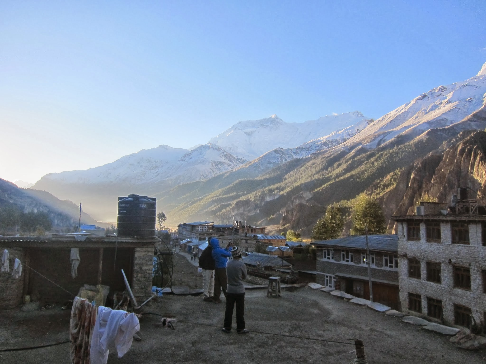
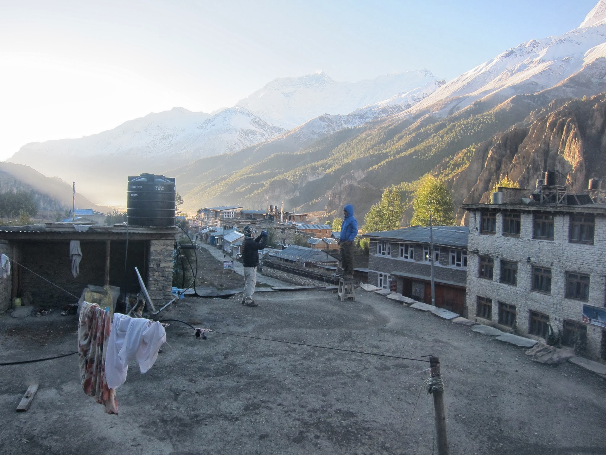

Otwieramy rano oczy, kierujemy wzrok za okno, a tam ku naszemu wielkiemu zaskoczeniu rozpościera się błękitne, bezchmurne niebo. Wyskakujemy z łóżek i biegniemy oglądać skąpane w słońcu skaliste szczyty otaczających nas łańcuchów górskich. Wreszcie widzimy to, po co tu przyjechaliśmy! Trasa dziś krótka, bo po 2h docieramy do Yak Kharki. Nocleg tutaj ważny jest ze względu na aklimatyzację (wysokość ok. 4100 m npm). W tych rejonach istotne jest, by kolejny nocleg nie był położony wyżej, niż 300-500 metrów od poprzedniego.

Robimy jeszcze krótki, półgodzinny spacer do kolejnej wioski – Letdaru. Resztę dnia przeznaczamy na odpoczynek i próbowanie kolejnej potrawy z nepalskiego repertuaru.

