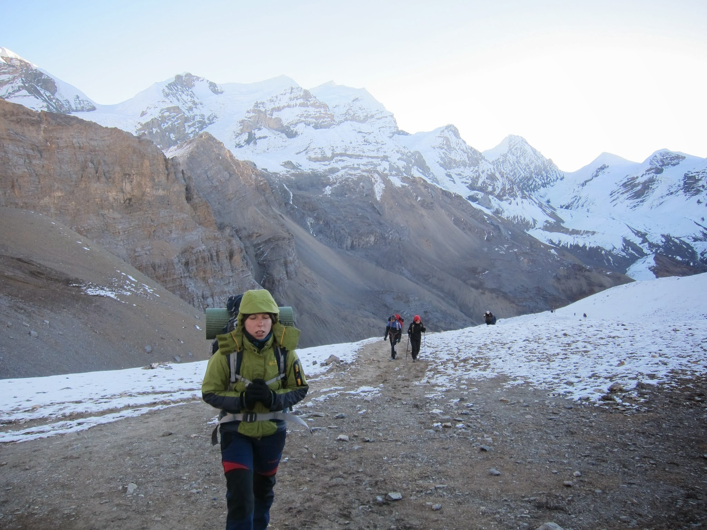
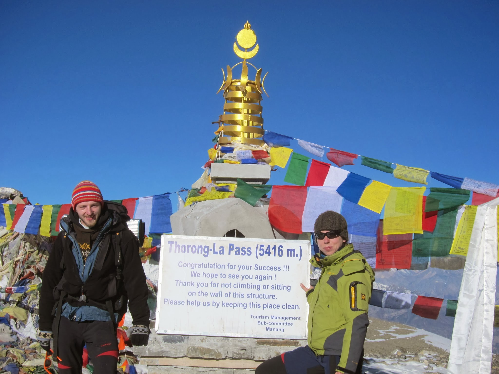
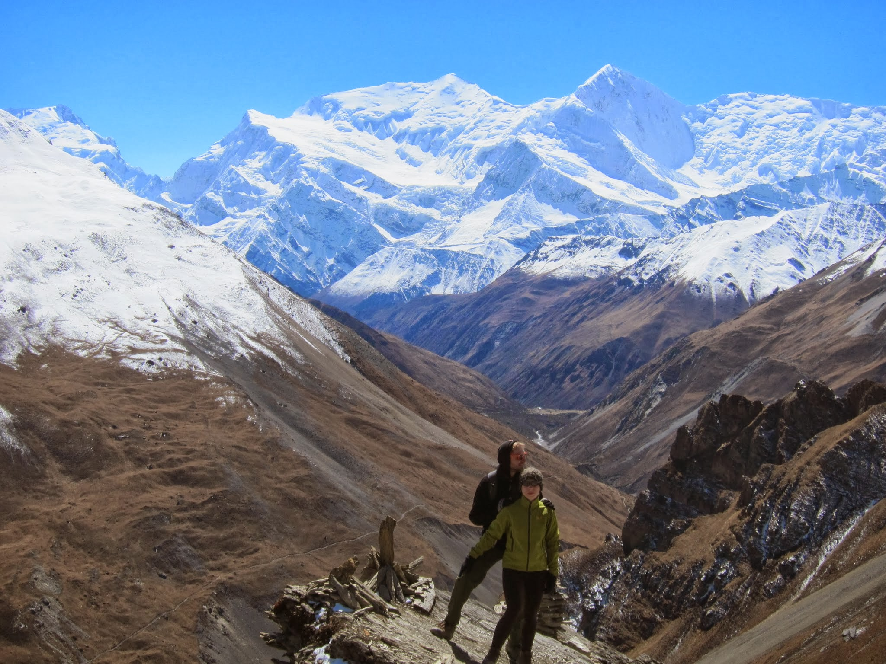
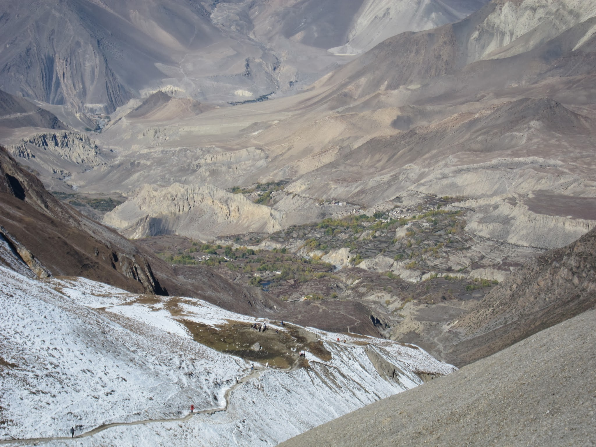

Pobudka o 4 nad ranem, szybkie śniadanko zamówione i opłacone dzień wcześniej – ruszamy tuż przed 5.

Tempo początkowe mamy świetne, żwawo wyprzedzamy wszystkich współtowarzyszy podróży: turystów oraz Nepalczyków, prowadzących torujące wąską ścieżkę, objuczone towarami kuce.

Kawałek za High Campem, w którym robimy jeszcze krótki postój, troszkę zwalniamy – rozrzedzone powietrze daje się Kasi we znaki. Oboje jednak jesteśmy w bardzo dobrym stanie, a droga okazuje się dużo łatwiejsza niż się obawialiśmy. Pogoda nadal dopisuje i góry, rozświetlane pomału wschodzącym słońcem, rozpieszczają nas swoim pięknem. Na samej przełęczy nie ma tłumów, jednak stoimy w kolejce do zdjęcia przy tablicy informującej o dotarciu na przełęcz.

Usatysfakcjonowani widokami, zjadamy batoniki energetyczne i rozpoczynamy mordercze zejście w dół – do Muktinath jeszcze 4,5 godziny drogi, w trakcie której schodzimy w sumie 1600 m niżej.

Pustynny i księżycowy krajobraz Mustangu, leżącego po drugiej stronie przełęczy, zachwyca i łagodzi trudy zejścia. Podczas zejścia zatrzymujemy się na chwilę uderzeni porażającą ciszą panującą dookoła. Na tej wysokości, wśród kamieni, skał i piasku, nie widać żadnych oznak życia. Brak wiatru, wody, roślin, ptaków. Nic nie szumi i nie szeleści. Są tylko góry i my. Dopiero po chwili bezruchu zaczyna być słychać dudnienie krwi w głowie.

Muktinath wita nas przestrzenią i przyjazną atmosferą. Wybieramy sobie przytulny hotelik – nasz pokój ma wyjście na taras i piękny widok na góry. Wspólnymi siłami robimy pranie i dobrą kolacją świętujemy pokonanie przełęczy.