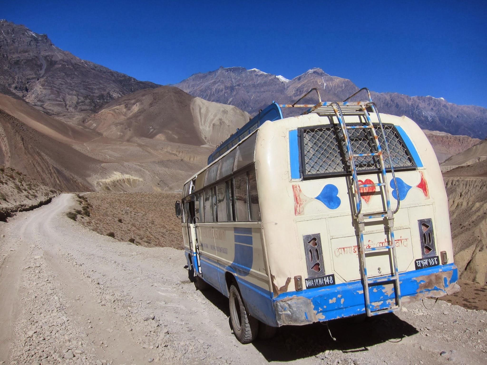
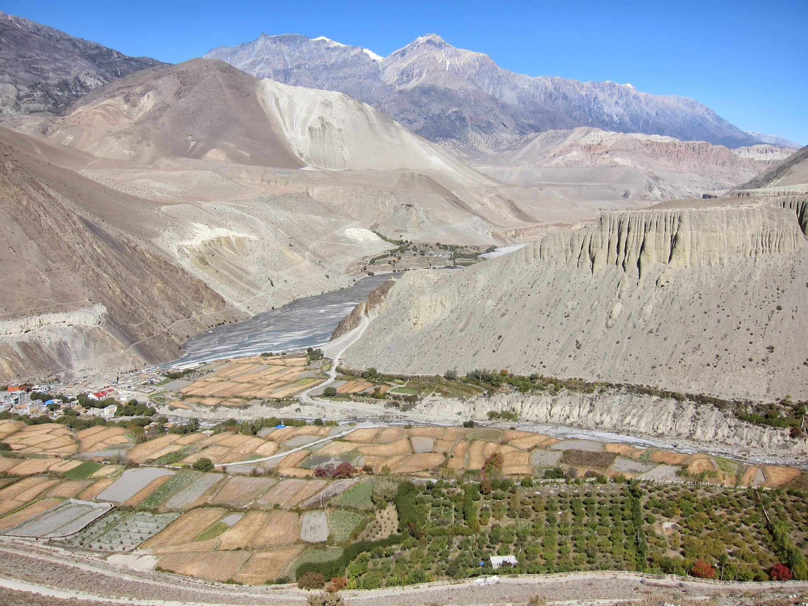
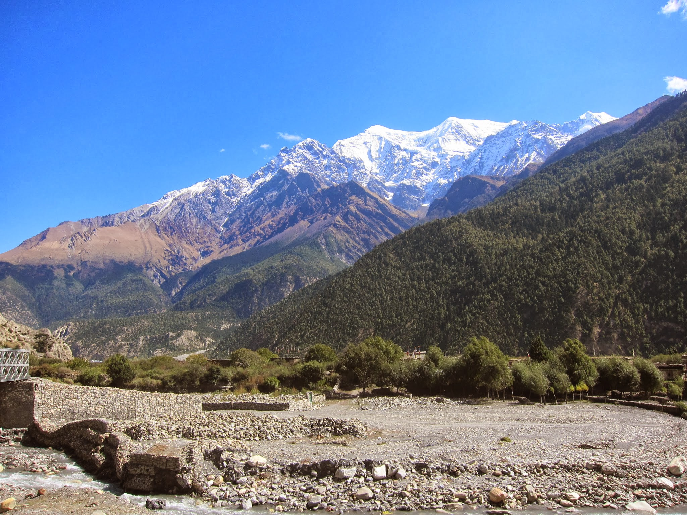
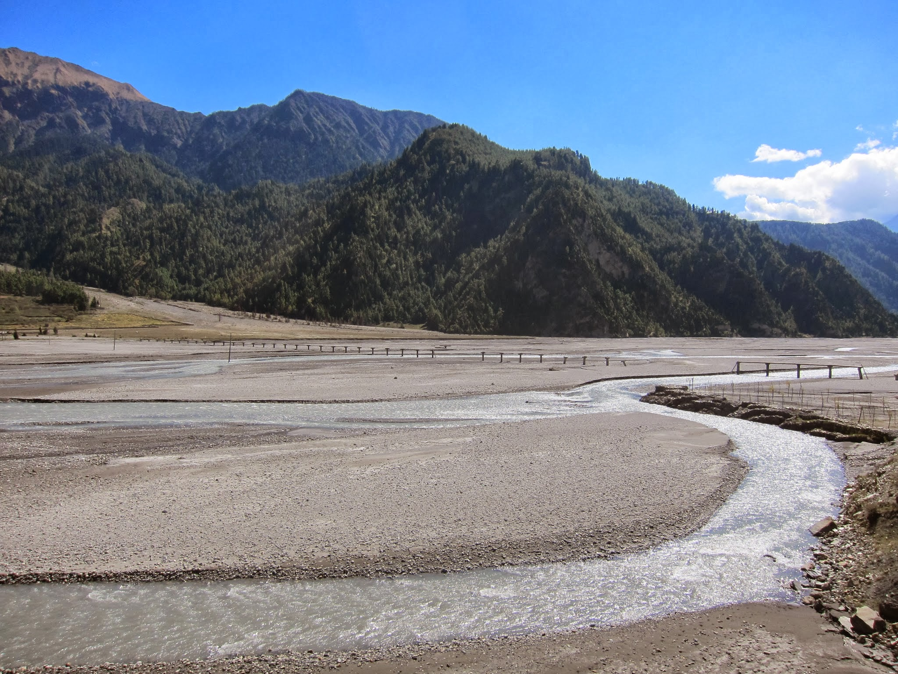

Okazuje się, że przełęcz wcale nie była najtrudniejszym odcinkiem na szlaku. Tuż za Kagbeni (zejście do którego wykańcza Kasi kolana) atakuje nas porywisty wiatr, wciskający nam w twarz i płuca ogromne ilości pyłu z bitej drogi, po której przejeżdżają co jakiś czas motory, jeepy i ciężarówki, potęgując tumany kurzu. Momentami z powodu wiatru nie słyszymy siebie nawzajem. W Jomsom, głównym mieście regionu, dowiadujemy się, że tak wieje codziennie od południa do wieczora, definiując rozkład lotów awionetek do Pokhary. Na nocleg zatrzymujemy się w Marphie, urokliwej wiosce położonej u stóp stromego wzgórza, która słynie ze swoich sadów i jabłkowego cidru.

Ku rozczarowani Kasi, w hotelu, w którym śpimy, nie mają owego trunku, zadowala się więc jabłkowym brandy.

Następny dzień to długa, ale już nie tak wietrzna, droga do Kalopani. Wraz z utratą wysokości powoli wkraczamy znów w tropikalne, zielone rejony doliny Kali Gandaki. Jest to jeden z najpiękniejszych fragmentów treku wokół Annapurny, obfitujący w widoki zarówno na same Annapurny, jak i Dhaulagiri (8,167 m – 7. góra świata).

Pełno jest też krótszych i równie atrakcyjnych bocznych szlaków, pozwalających na 1-3 dniowe wycieczki.

