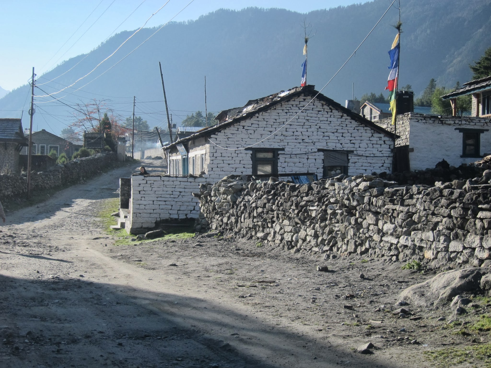
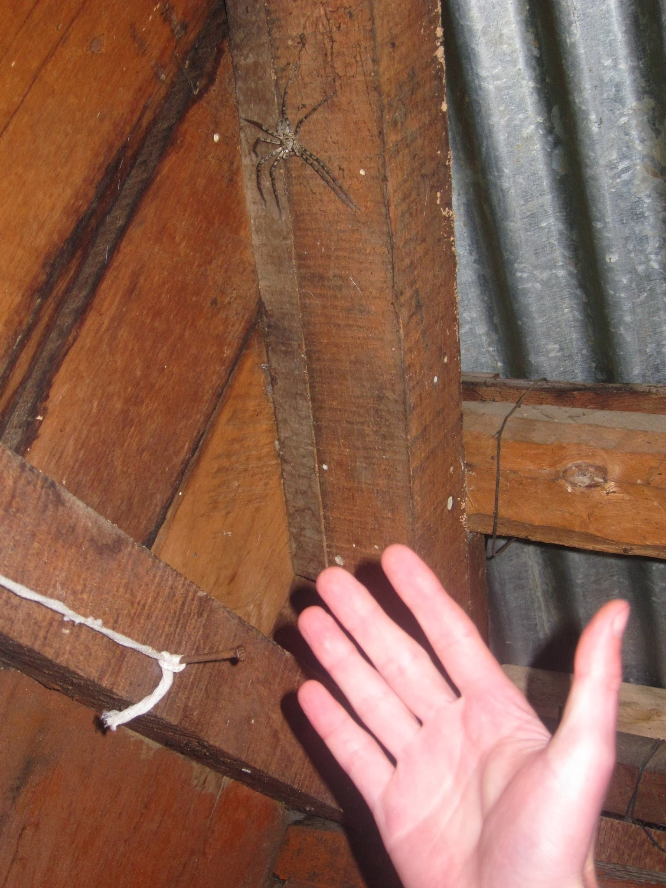
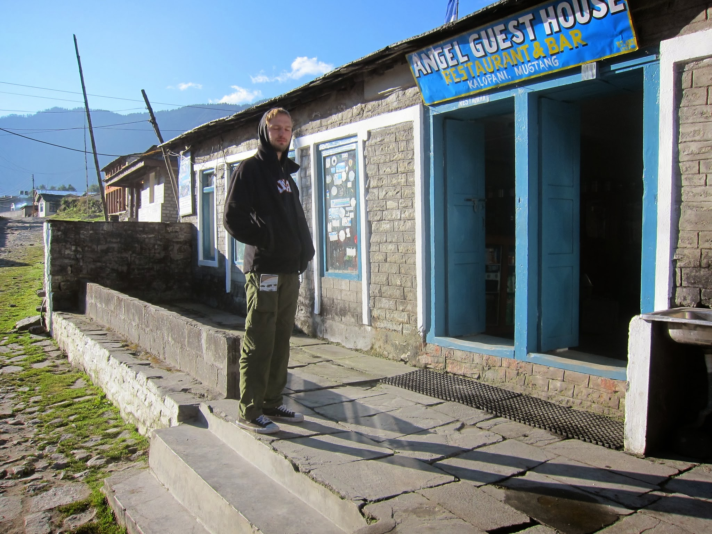

Zachęceni zasłyszanymi opiniami, na koniec treku chcemy zdobyć jeszcze Poon Hill (3200 m npm), z którego podobno roztaczają się najpiękniejsze widoki w okolicy. Żeby troszkę podgonić czas łapiemy lokalny autobus z Ghasy do Tatopani. 13 km jedziemy bagatela 3 godziny! Z Tatopani (1200 m npm) stroma ścieżka prowadzi nas w górę przez urokliwe wioski, pełne tropikalnej roślinności i mandarynkowych gajów, przetykanych występującymi w charakterze chwastów ogromnymi krzakami konopii indyjskich 🙂

Po drodze spotykamy lekko świrniętego staruszka posługującego się płynnym angielskim i posiadającego szeroką wiedzę, z zakresu od biologii, poprzez chemię, do filozofii, cybernetyki i nowoczesnych technologii włącznie. Rekomenduje nam miejsce z dobrym jedzeniem wyznaczając jednocześnie dość ambitny cel na dziś: do pokonania jeszcze ponad 3 godziny, a do zmroku zostało ponad 2,5. Mimo ciemności udaje nam się znaleźć właściwe miejsce. Budynek hoteliku jest w całości pochylony w kierunku zbocza. Łóżka, by zachować poziom, mają podłożoną belkę, a pod prysznicem, na szczęście już po kąpieli, Kasia znajduje gigantycznego pająka.

Na kolację wybieramy tradycyjny, nepalski zestaw: Dal Bhat, czyli ryż z zupą (najczęściej z soczewicy), piklami, ziemniaczanym, warzywnym curry oraz papadem (pikantne pieczywo przypominające dużego chipsa). Największą zaletą tego dania jest możliwość wzięcia dokładki (drugie tyle!) bez dodatkowej dopłaty, pod warunkiem, że zamawiamy Dal Bhat na jedną osobę. A wcale nie jest to najdroższa pozycja w menu. Tego wieczoru zjedliśmy najlepszy (i najbardziej pikantny) Dal Bhat na treku.

