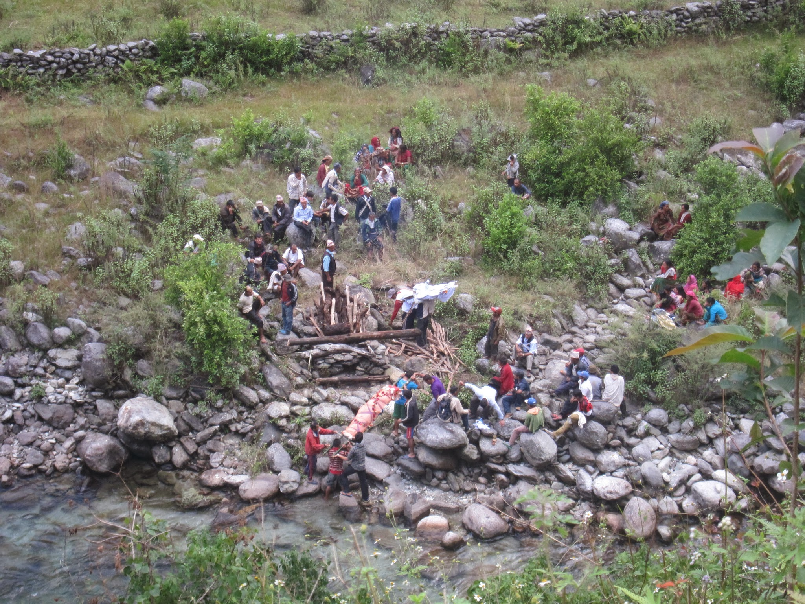
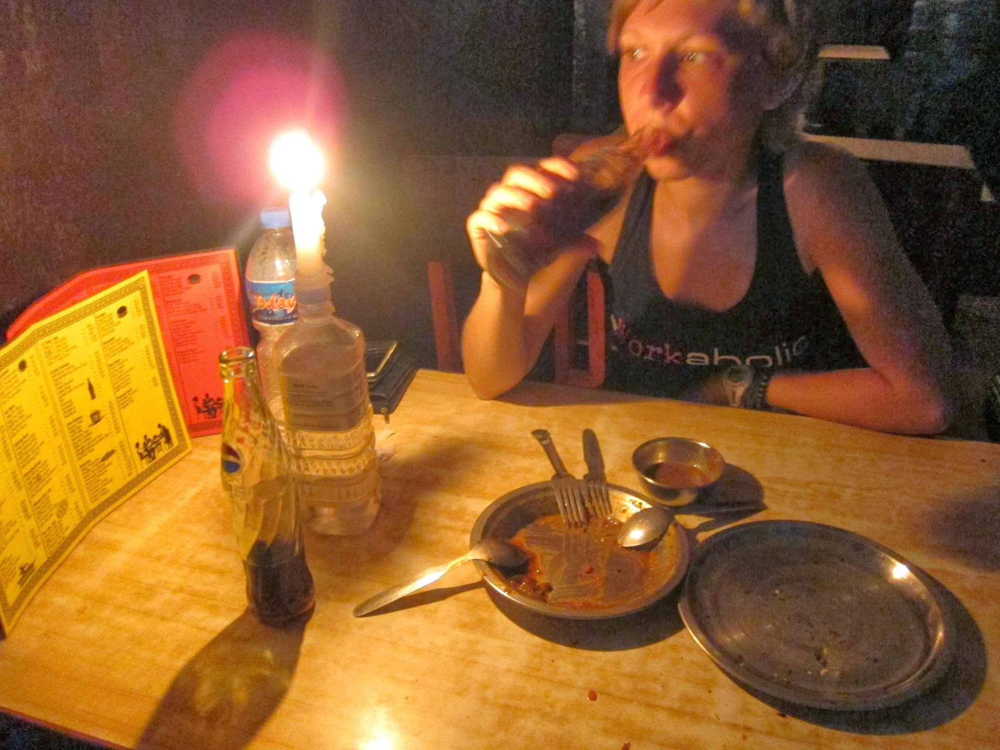
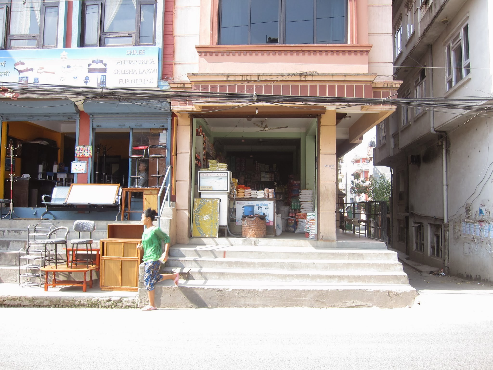

Mega długi i ciężki dzień – kupy i schody… duuuuużo schodów. Z Gharopani (2800 m npm), z braku dobrej pogody (chmury zakryły wszystkie szczyty powyżej 4 tys. m) nie wychodzimy na Poon Hill tylko od razu kierujemy się w stronę Naya Pul, skąd odjeżdżają autobusy do Pokhary. Zgodnie z mapą powinniśmy w 3,5 godziny być na miejscu. Niestety rzeczywistość okazuje się być dużo bardziej brutalna i tak naprawdę to dzisiaj jest najgorszy dzień na szlaku. W 6,5 godziny pokonujemy wąską trasę w większości składającą się z kamiennych schodów, o miejsce na których walczymy z karawanami objuczonych kuców. Na dwie godziny przed zmrokiem schodzimy na bardziej wypłaszczone tereny (ok. 1200 m npm) i około 17 łapiemy autobus do Pokhary.

Wycieńczeni i głodni nie jesteśmy zbyt wybredni szukając noclegu, zwłaszcza, że ceny tutaj są dużo wyższe niż w górskich hotelikach. Trafiamy do najobrzydliwszego pokoju, jaki do tej pory widzieliśmy, a łazienka okazuje się być jeszcze gorsza. Nic to, byle do rana.

A rano… chmury, chmury i chmury. Dla porządku idziemy nad jezioro, z którego jeszcze dzień wcześniej mieliśmy nadzieję zobaczyć piękne widoki na pasmo Annapurny. No cóż… ewidentnie musimy tu wrócić!

A tymczasem śniadanko i łapiemy transport do Kathmandu, tym razem w cenie 450 RS od osoby, zamiast 1000 RS, które zapłaciliśmy w przeciwną stronę. Z czasem stajemy się coraz mądrzejsi, coraz lepiej znamy ceny i nie tak łatwo już nas naciągnąć.

W Kathmandu czeka kolejna niespodzianka: nasz dotychczasowy gospodarz gości u siebie rodzinę i nie może nas przenocować. Na szczęście w sąsiedztwie jego domu jest w miarę tani hotelik, więc zabieramy pozostawiony namiot i inne ciężkie, a niepotrzebne na treku rzeczy. Rano biegusiem do ambasady hinduskiej złożyć paszporty.

