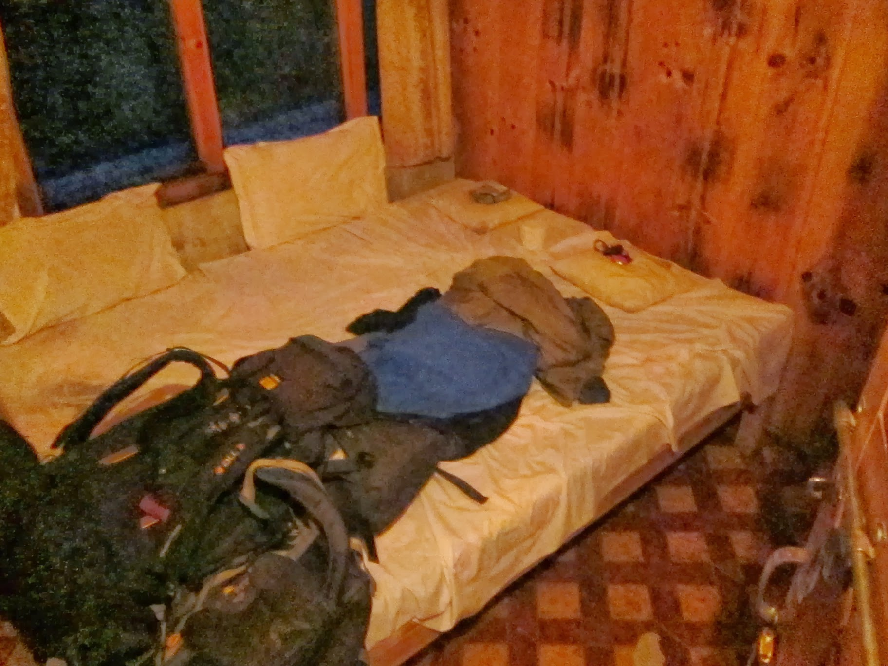
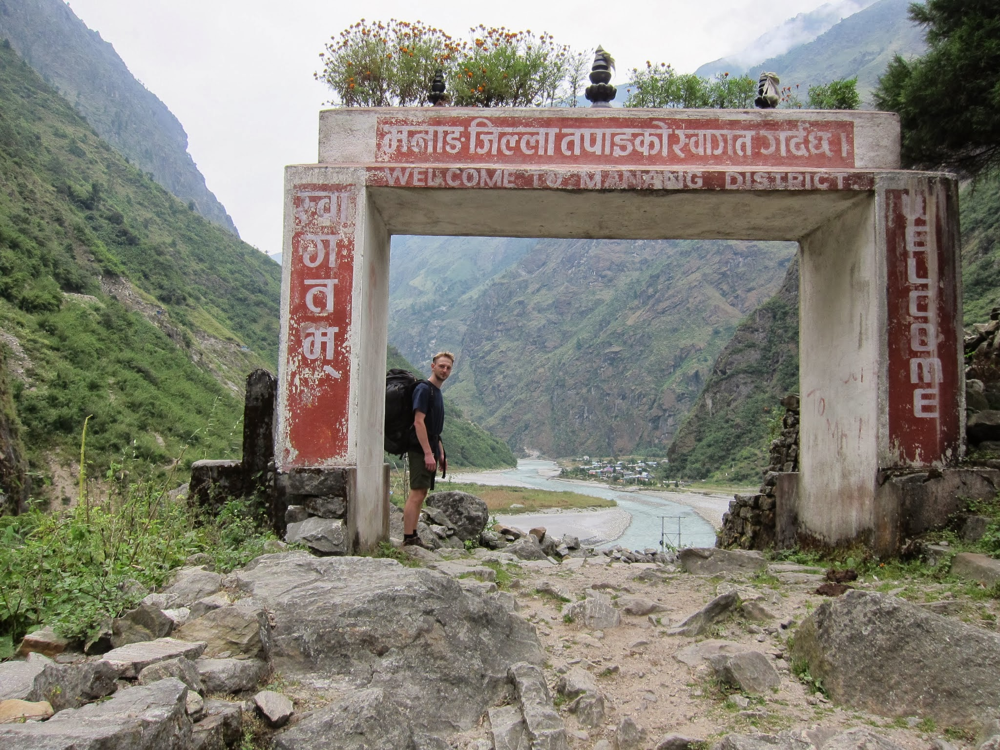
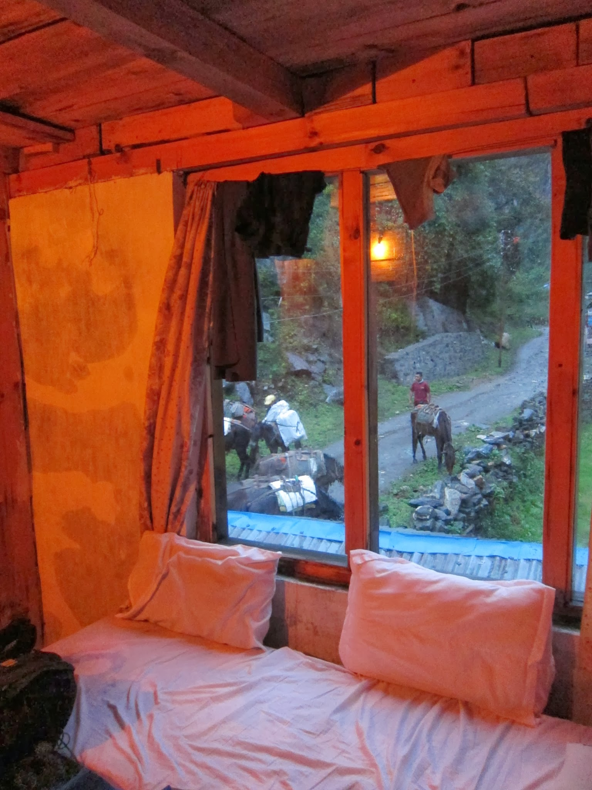

Leje… leje… i tak całą noc. I nie zanosi się, jakby miało w najbliższym czasie przestać. Zostajemy kolejną noc w Dharapani, okna nam ciut przeciekają, ale cóż… Gramy w karty.

Wieczorem, gdy przekonfigurowaliśmy cały pokój, żeby woda nie kapała nam na łóżka, przestało lać. Po kolacji skapywały ostatnie krople. Niezależnie od tego, czy lekki teraz wiaterek cokolwiek w nocy zmieni, wyruszamy rano w dalszą, zaraz po śniadaniu.

Gospodarz, zapytany wprost o cenę hot water do naszego półlitrowego kubka, pokazuje najmniejszy rozmiar 200 ml za cenę 35 RS.

Przed zmrokiem przyjechał transport na kucach z całą bandą krzepkich Nepalczyków: zaopatrzenie dla chaty oraz sprzęt turystyczny dużej grupy Niemców, którzy, sądząc po ich posturze, wybierają się w bardziej wymagające rejony Himalajów. Kasia sugeruje, że może na wschód, w kierunku Manaslu trek.

Kilkadziesiąt płóciennych i sportowych worków w kilka chwil zostało umieszczonych pod dachem.

W oczekiwaniu na naszą sztywną godzinę pójścia spać (20) układamy pasjansa. Spomiędzy porozwieszanych do suszenia ciuchów wychodzi gospodarz. Pyta co chcemy jutro na śniadanie i czy nam nie przeszkadza, że teraz musimy zamówić – jest dużo ludzi do wykarmienia.

– To zamówcie teraz, ok?

– Jasne, będzie owsianka i 2 bułki z czekoladą.