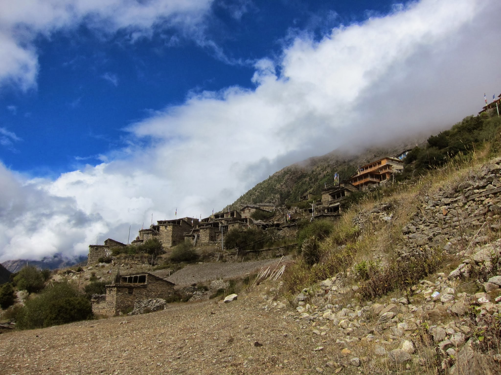
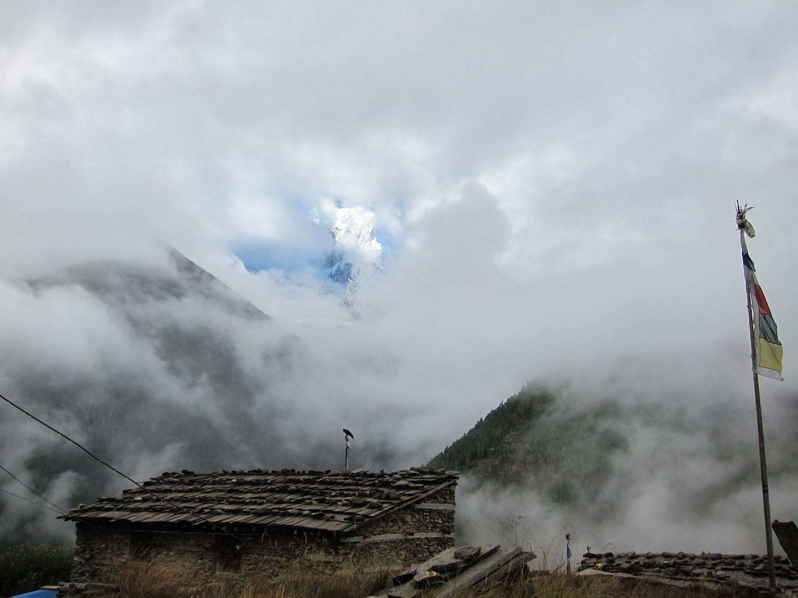
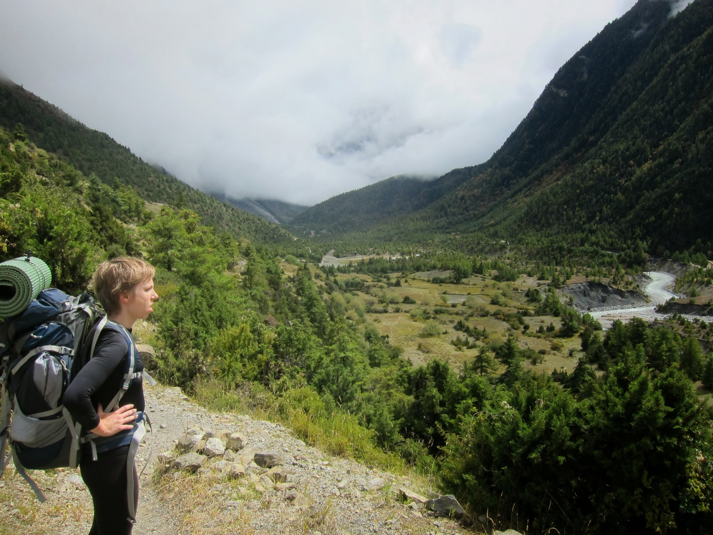

Rano wczesna pobudka, ale coś nie możemy się wygrzebać z łóżek. Motywuje nas jednak informacja o okienku dobrej pogody, które ma być pomiędzy 7 a 13. Chcemy je wykorzystać na dojście do Upper Pisang. W Chame wciąż jeszcze popaduje, ale już nie tak mocno, jak wczoraj. Na wszelki wypadek Michał kupuje jednak poncho przeciwdeszczowe, aby uniknąć ponownego zamoczenia plecaków.

Przestaje padać i zaczyna robić się co raz cieplej – spoglądam w niebo: TAK! To słońce, nieśmiało jeszcze, ale jednak przedziera się przez chmury. Dość szybko docieramy na miejsce i znajdujemy sobie przyjemny hotelik w wiosce w całości położonej na zboczu góry. W dole widać Lower Pisang. Przed nami rozpościerają się też widoki na dalszą część doliny, w stronę Manangu. Żal nam, że chmury zasłaniają widoki, wciąż bowiem nie udało nam się ujrzeć żadnej z Annapurn.

Wczoraj jeszcze w Chame dowiedzieliśmy się, że warstwa chmur jest gruba, a w Manangu pada śnieg, blokując przejście przez Thorung La Pass. Podobno z powodu śniegu odcięty jest również region Everestu. Jeden z przewodników mówi, że pogoda co roku jest inna, ale to, co widzimy teraz za oknem, to efekt szalejącego nad Indiami cyklonu.

Nam pozostaje trzymać kciuki za słońce nad Manangiem i wyżej, tak, aby śnieg przestał blokować przełęcz. Wiele ludzi czeka w Manangu już od paru dni, nie mogąc ruszyć dalej, więc wiele hotelików jest pełnych.

