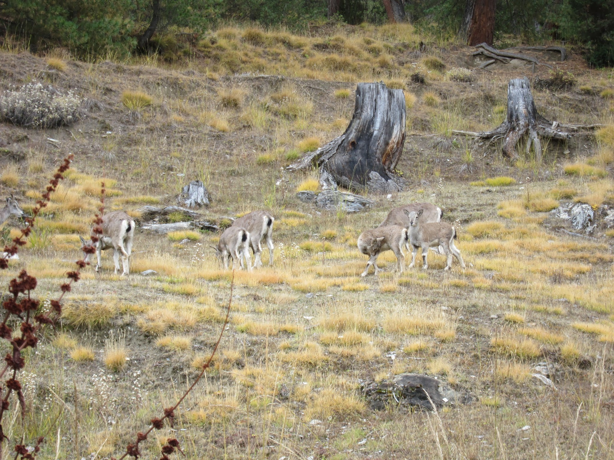
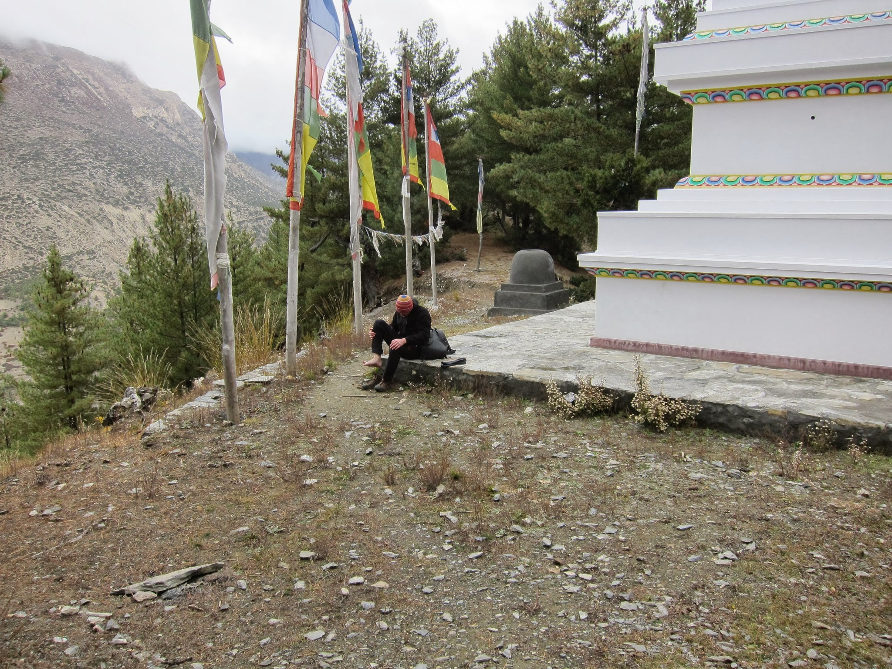
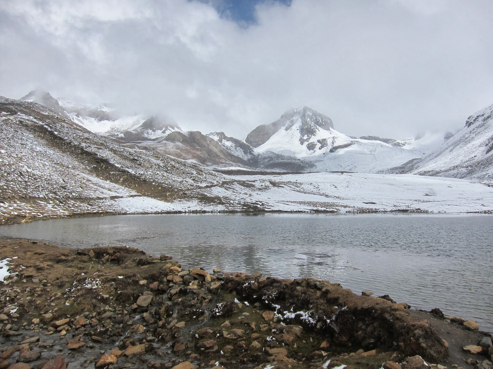
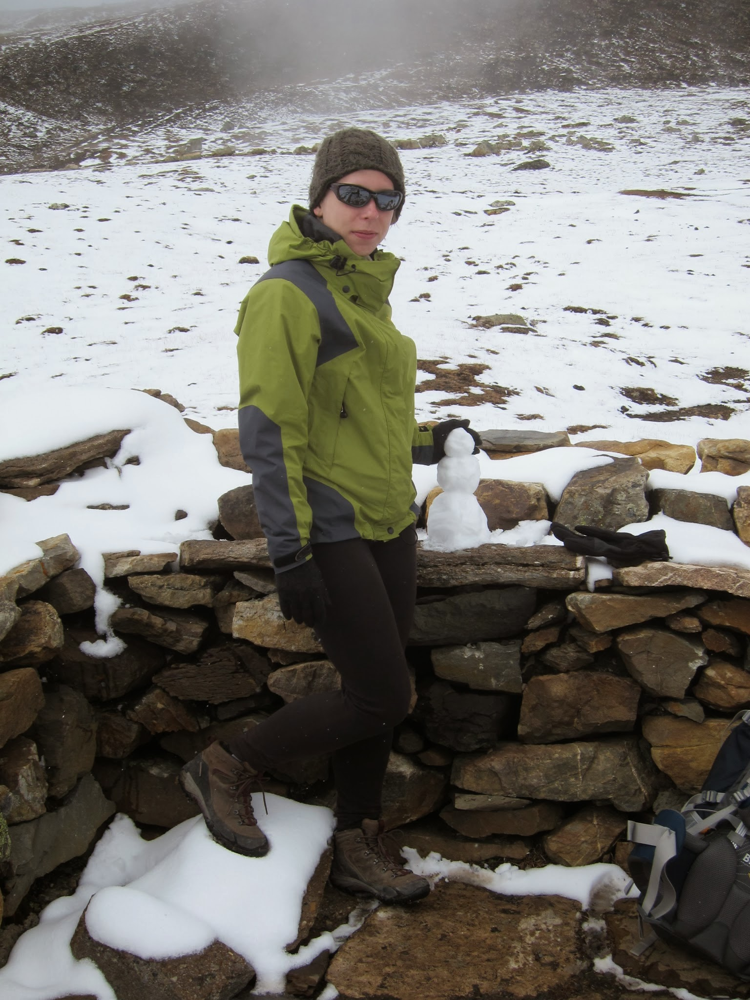

W oczekiwaniu na dobrą pogodę robimy sobie spacery aklimatyzacyjne. Na pierwszy ogień Milarepa Cave (4100 m npm) – miejsce, w którym kilka lat spędził na medytacjach i modłach pustelniczy mnich, żyjący w XI wieku. Po drodze mijamy magiczną polankę, na której, w pobliżu ruin małej wioski, pasie się chmara himalajskich kozic. Zwierzaki dają się spokojnie fotografować, niewiele robiąc sobie z naszej obecności.

U celu doganiają nas chmury i lekko oprósza nas śnieg.

Kolejny dzień przeznaczamy na podejście pod jezioro lodowcowe (Ice Lake – 4800 m npm). Pogoda znów nas nie rozpieszcza, ale postanowiliśmy wyjść tam niezależnie od aury dla dobra aklimatyzacji. Miejsce, z pewnością urokliwe przy słonecznej pogodzie, nam na moment pozwala odpocząć od porywistego wiatru.

