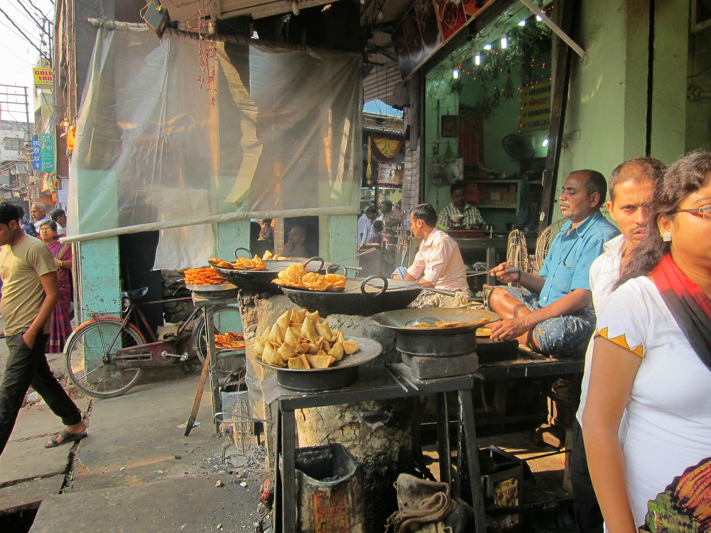
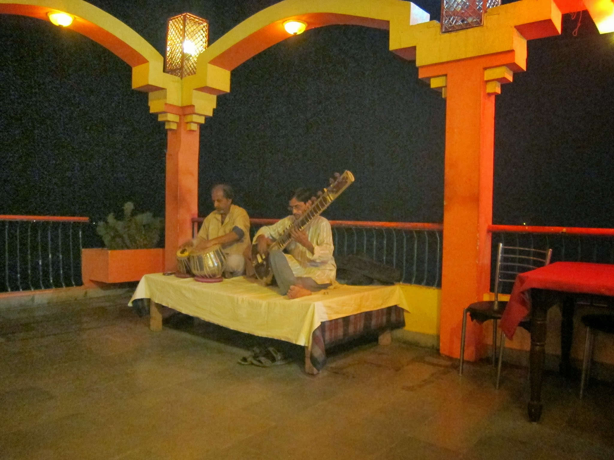
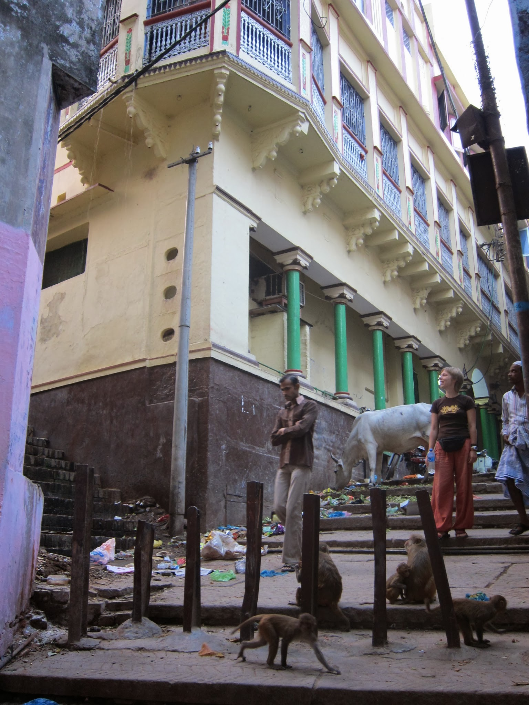
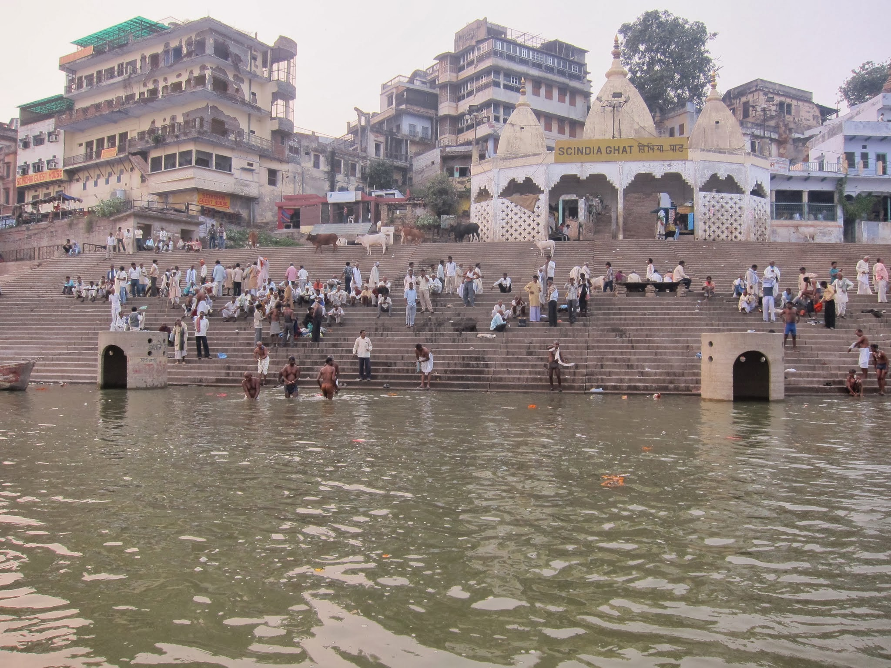

4 listopad

8:30

Po całkiem nieźle przespanej nocy w sleeper class, za który ostatecznie nie zapłaciliśmy (general ticket wystarczył najwidoczniej trochę roztrzepanemu konduktorowi) wcinamy śniadanko w restauracji na dachu naszego kolejnego miejsca noclegowego.

Do hoteliku przecisnęliśmy się przez wąskie uliczki muzułmańskiej części miasta. Gospodarz poprowadził nas przez ciemne, kręte korytarze i otworzył przed nami dobrze oświetlony wschodzącym słońcem pokój z widokiem na wysokie budynki rozciągnięte wzdłuż zachodniego brzegu Gangesu.

Zamiast się rozpakować, szybko opuściliśmy przestronny, jasny pokój, by udać się na szamkę. Nie jesteśmy bardzo głodni, bo po pociągu i autorykszy trafiliśmy na świetną samosę za 5 RS / szt.

Dzisiaj pozanawanie miasta i odpoczynek po podróży.

Wieczorem

Wyczerpani po całym dniu snucia się po mieście, siedzimy na koncercie odbywającym się codziennie w popularnym guest house. W duecie sitar (klasyczny hinduski instrument strunowy) i tabla (2 bębenki o różnej średnicy). Głównym celem dzisiejszej podróży były położone najbliżej nas ghaty, czyli schody na brzeg świętej rzeki, służące za miejsca palenia zwłok, rytualnych kąpieli po ceremoni kremacji, spotkań towarzyskich, rytuału puja (oczyszczanie ogniem), czy też full-body massage na stojąco, na który z braku czujności dałem się naciągnąć!

Od przedwczoraj wszędzie wokół wybuchają fajerwerki, ludzie życzą nam happy diwali, a my zapychamy się kolejnymi pysznymi potrawami kuchni południowych Indii (masala dosa, idli i uttapam).

Varanasi, jedno z siedmiu świętych miast (7mka to też święta liczba), zachwyca wąskimi uliczkami starego miasta, wijącymi się pomiędzy wysokimi budynkami z glinianą elewacją, pełnymi nieoczekiwanych zaułków z kolorowymi kapliczkami poświęconymi hinduskim bóstwom. Ganesh z głową słonia, granatowy Krishna, czy Hanuman – małpi bóg, to póki co jedyne rozpoznawane przeze mnie. Jest ich całkiem sporo – podobno znanych jest ponad 300 mln różnych wcieleń 3 podstawowych bóstw: Brahmy, Vishnu oraz Shivy.

Próbując, pośród istnego labiryntu ulic niezaznaczonych na uproszczonej mapie z przewodnika, znaleźć meczet zamiast tego trafiamy do dosyć dużej hinduskiej świątyni. Zdejmujemy buty, zaproszeni do środka przez mężczyznę siedzącego wewnątrz na kamiennym podwyższeniu otaczającym wąski korytarzyk wokół głównej kaplicy pośrodku świątyni.

Będąc już wewnątrz wpadamy w lekką dezorientację: kobiety i mężczyźni siedzący wokół korytarzyka zaczynają wołać do nas robiąc bliżej nieokreślone gesty rękami uzbrojonymi w miotełki długości ramienia. Sprawiali wrażenie, jakby jednocześnie chcieli skłonić nas do przemieszczanie się w ich kierunku w celu błogosławieńtwa i starali się za pomocą klątwy wyrzucić nas ze świątyni.

Nie bardzo wiadomo, czy iść w lewo, w prawo, do przodu, czy wiać czym prędzej! Wokół kolorowo, kwieciście i świetliście. Unikamy kilku miotełek, próbując w małym tłumie zrozumieć cokolwiek z tego, co widzimy. W tym chaosie jakoś trafiamy w pobliże młodego Hindusa, który coś zaczyna mówić i tłukąc nas miotełką po głowach i plecach. Szybko owija rękę w nadgarstku kolorowymi sznureczkami i wciera popielate tika w czoło.

Za właśnie otrzymane błogosławieństwo każe sobie płacić 500 rs od osoby, powtarzając w kółko: bakshish, bakshish. Szaleństwo! Daję mu 100 rs za nas oboje, na co on mruczy coś z kwaśną miną pod nosem, więc zaczynam się obawiać o efekt tego błogosławieństwa. Facet, czekający obok nas na swoją porcję skomplikowanych i szybkich usług spirytualistycznych, klepie mnie po plecach:

– It’s OK – uśmiecha się.

Idziemy więc dalej, trzymając się poza zasięgiem miotełek.

Święte miasto ma też swoją złą stronę i przeraża: ilością śmieci, odorem uliczek, niemożliwie zasranych przez wszędobylskie psy, małpy i przede wszystkim krowy, które bez skrępowania grzebią nosami i rogami w plastikowych workach pełnych organicznych odpadków. Mnóstwo turystów, pielgrzymek, uzbrojonych w strzelby policjantów lub innych komandosów, robaków, owadów, motorów (właściwie to przeszkadzają tylko – aż – klaksony!!!) i nagabywaczy, których techniki poznajemy co kilka kroków (czasami za darmo, czasami za 100 rs).

Koncert płaczliwej sitar i dynamicznych bębenków skończył się nieoczekiwanie. Będzie trzeba jeszcze kiedyś wybrać się na takie przedstawienie z żywą muzyką, żeby lepiej rozkodować skomplikowane rytmy i melodię brzęczących strun.

Oglądamy jeszcze wybuchające w całym mieście fajerwerki i idziemy spać. Jutro kolejne atrakcje.

5 listopad

Pechowy dzień:

– przez pozostawione otwarte okno (zakratowane!) w pokoju małpy podprowadziły nam 4 małe opakowania czekoladowych płatków do śniadania,

– z braku mostu, nie udało się dotrzeć do fortu położonego zdala od starego miasta,

– nie było ani yogi (nauczyciel się rozchorował), ani lassi (happy diwali!),

– nie zdążyliśmy do Aum Cafe.

Za to odkryliśmy miłą okolicę Assi Ghatu, z jego kulinarnym przysmakiem Aloo tiki, które wszamaliśmy na kolację – pycha! 🙂

6 listopad

Hotel, w którym śpimy, w cenie noclegu oferuje wycieczki łódką go Gangesie. Do wyboru wschód lub zachód słońca. Decydujemy się na zachód, bo jest to pora, kiedy nad rzeką toczy się najwięcej życia. Nasz wyluzowany boatman już po 5ciu minutach oferuje nam zapalenie skręta, spod pokładu wyciągając swoje zapasy.

– Jest bardzo dobra, z Afganistanu, kumpel mi przywiózł. Lubię sobie codziennie wieczorem zapalić. Macie bibułki?

Z tej oferty nie korzystamy, ale chłoniemy jego opowieści o tym, co dzieje się na brzegu świętej rzeki. Widząc nasze zaniepokojenie, rosnące wprost proporcjonalnie do ilości pojawiających się wokół komarów, uspokaja:

– No worries, I sleep on the boat every night. One thousand mosquitoes – no malaria!